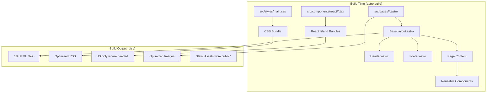
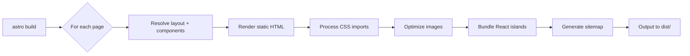

# Design Document: Astro Migration

## Overview

This design describes the migration of the GAMEC website (igamec.org) from a static HTML5 site with jQuery-based dynamic component injection to an Astro 5.x static site generator. The migration preserves all 18 pages, the existing CSS module system, accessibility patterns, and SEO metadata while introducing component-based architecture, build-time optimization, React islands for complex interactivity, and future Clerk authentication compatibility.

The core architectural shift is moving from runtime component injection (fetching `header.html`/`footer.html` via JavaScript) to build-time composition (Astro layouts and components). This eliminates the need for jQuery's dynamic loading, reduces client-side JavaScript, and produces faster-loading static HTML with zero-JS by default.

### Key Design Decisions

1. **Static output with `.html` extensions** — preserves existing URL structure without server rewrites
2. **CSS preserved as global styles** — the 23-module CSS system imports unchanged into Astro's build pipeline
3. **jQuery eliminated** — navigation rewritten in vanilla JS; `.panel()` and `.navList()` reimplemented
4. **React islands for complex state** — QuranViewer as first React island with `client:visible` hydration
5. **Build-time navigation highlighting** — `.current` class applied at build time via Astro component props
6. **Future-ready for Clerk** — reserved routes and directory structure without installing dependencies

## Architecture

### High-Level Architecture



### Project Structure

```
gamec/
├── astro.config.mjs              # Astro configuration
├── tsconfig.json                 # TypeScript config extending astro/tsconfigs/strict
├── package.json                  # Dependencies and scripts
├── public/                       # Static assets (copied verbatim to dist/)
│   ├── images/                   # All site images (hero banners, logos, gallery)
│   ├── assets/
│   │   └── webfonts/             # Font Awesome woff2/ttf files
│   ├── manifest.json             # PWA manifest
│   └── robots.txt                # Generated or static robots.txt
├── src/
│   ├── pages/                    # Route-generating pages (1 file = 1 URL)
│   │   ├── index.astro
│   │   ├── vision.astro
│   │   ├── history.astro
│   │   ├── leadership.astro
│   │   ├── contact.astro
│   │   ├── programs.astro
│   │   ├── relief.astro
│   │   ├── sisters.astro
│   │   ├── youth.astro
│   │   ├── seniors.astro
│   │   ├── professionals.astro
│   │   ├── health.astro
│   │   ├── membership.astro
│   │   ├── donate.astro
│   │   ├── media.astro
│   │   ├── resources.astro
│   │   ├── matrimonial.astro
│   │   ├── donation-receipts.astro
│   │   ├── sign-in.astro         # Reserved for future Clerk auth
│   │   └── sign-up.astro         # Reserved for future Clerk auth
│   ├── layouts/
│   │   └── BaseLayout.astro      # Shared HTML shell (head, header, footer)
│   ├── components/
│   │   ├── Header.astro          # Site header with navigation
│   │   ├── Footer.astro          # Site footer (4-column layout)
│   │   ├── LivestreamCard.astro  # Makkah/Madinah livestream embed
│   │   ├── ProgramCard.astro     # Program card (icon, title, description, link)
│   │   ├── ImpactStats.astro     # Impact statistics section
│   │   ├── DonationMethods.astro # Square/PayPal/Zelle donation section
│   │   ├── CommunityGroupCard.astro # Community group card
│   │   ├── react/                # React island components
│   │   │   └── QuranViewer.tsx   # PDF.js Quran viewer (client:visible)
│   │   └── auth/                 # Reserved for future Clerk components
│   │       └── .gitkeep
│   └── styles/
│       ├── main.css              # Entry point — @imports all 23 modules
│       ├── media.css             # Additional media styles
│       ├── fontawesome-all.min.css # Font Awesome stylesheet
│       └── modules/              # 23 CSS module files (unchanged)
│           ├── _imports-fonts.css
│           ├── _variables.css
│           ├── _reset.css
│           └── ... (all 23 modules)
├── dist/                         # Build output (gitignored)
└── .kiro/                        # AI steering and specs
```

### Build Pipeline



## Components and Interfaces

### BaseLayout.astro

The shared layout wraps every page with the complete HTML document shell.

```typescript
// BaseLayout.astro Props Interface
interface Props {
  title?: string;                    // Page title (default: "GAMEC")
  description?: string;              // Meta description (default: org tagline)
  canonicalPath?: string;            // Path segment for canonical URL (e.g., "/donate.html")
  ogImage?: string;                  // OG image URL (default: logo-bg.png absolute URL)
  robots?: string;                   // Robots directive (default: "index, follow")
  bodyClass?: string;                // Additional body classes (e.g., "homepage no-sidebar")
  dataPage?: string;                 // data-page attribute value for body
  structuredData?: object[];         // Array of JSON-LD objects to embed
  pageScripts?: string[];            // Page-specific script paths to include
}
```

**Responsibilities:**
- Renders `<!DOCTYPE html>`, `<html lang="en">`, `<head>`, `<body class="is-preload {bodyClass}">`
- Outputs all meta tags (charset, viewport, description, robots)
- Outputs favicon links (ICO with `sizes="any"`, PNG with `type="image/png" sizes="32x32"`, apple-touch-icon)
- Outputs manifest.json link
- Outputs canonical URL using `site` config + `canonicalPath`
- Outputs Open Graph tags (og:title, og:description, og:image, og:url, og:type, og:site_name, og:locale)
- Outputs Twitter Card tags (twitter:card as "summary", twitter:title, twitter:description, twitter:image)
- Outputs dns-prefetch and preconnect hints for Google Fonts
- Outputs JSON-LD structured data blocks from `structuredData` prop
- Imports global CSS (`main.css`, `media.css`, `fontawesome-all.min.css`)
- Renders `<noscript>` fallback at top of `<body>`
- Renders `<Header>` component with current page path
- Renders `<slot />` for page content
- Renders `<Footer>` component
- Includes shared client-side scripts (navigation init, scroll reveal, preload removal)
- Includes page-specific scripts from `pageScripts` prop

### Header.astro

```typescript
// Header.astro Props Interface
interface Props {
  currentPath: string;  // Current page filename (e.g., "donate.html")
}
```

**Responsibilities:**
- Renders skip-to-content link (`<a href="#main-wrapper" class="skip-link visually-hidden">`)
- Renders logo section with link to index.html
- Renders full `<nav>` with `role="navigation"` and `aria-label="Main navigation"`
- Applies `.current` class to matching `<li>` based on `currentPath` prop
- For submenu items: applies `.current` to both the submenu `<li>` and parent dropdown `<li>`
- Preserves `aria-haspopup="true"` and `aria-expanded="false"` on dropdown parent links
- All navigation markup rendered at build time (no runtime fetch)

### Footer.astro

**Responsibilities:**
- Renders 4-column footer layout (Sitemap, Resources, Quick Links, Contact)
- Renders social media links with `target="_blank"`, `rel="noopener noreferrer"`, and `.visually-hidden` labels
- Renders copyright notice and site credit
- All footer markup rendered at build time

### QuranViewer.tsx (React Island)

```typescript
// QuranViewer.tsx Props Interface
interface QuranViewerProps {
  pdfUrl: string;           // Cloudflare R2 CDN URL for Quran PDF
  workerUrl: string;        // PDF.js worker CDN URL
}
```

**Responsibilities:**
- Loads PDF.js dynamically within the component
- Implements all 14 existing viewer functions: `goToPage`, `clampPage`, `doZoom`, `resetZoom`, `clampZoom`, `adjustZoom`, `buildToc`, `toggleToc`, `getCurrentSurah`, `saveState`, `loadState`, `renderPage`, `showError`, and initialization
- Persists page/zoom state to localStorage
- Renders canvas element for PDF page display
- Provides navigation controls (prev/next, page input, surah TOC)
- Provides zoom controls (zoom in/out, reset)
- Hydrates only when scrolled into viewport (`client:visible`)

### Reusable Page Components

| Component | Props | Usage |
|-----------|-------|-------|
| `LivestreamCard.astro` | `title`, `thumbnailSrc`, `thumbnailAlt`, `embedUrl` | Homepage and media page livestream embeds |
| `ProgramCard.astro` | `title`, `description`, `icon`, `href` | Programs page card grid |
| `ImpactStats.astro` | `stats: {label, value}[]` | Homepage impact section |
| `DonationMethods.astro` | (none — self-contained) | Donate page payment methods |
| `CommunityGroupCard.astro` | `title`, `description`, `href`, `icon` | Homepage community groups section |

## Data Models

### Page Metadata

Each Astro page passes metadata to `BaseLayout` via props in its frontmatter:

```typescript
// Example: donate.astro frontmatter
---
import BaseLayout from '@layouts/BaseLayout.astro';

const pageData = {
  title: "Donations | GAMEC",
  description: "Support GAMEC through Square, PayPal, or Zelle donations.",
  canonicalPath: "/donate.html",
  bodyClass: "no-sidebar",
  dataPage: "donate",
};
---
<BaseLayout {...pageData}>
  <!-- page content -->
</BaseLayout>
```

### Navigation Data Structure

The navigation structure is defined as a typed constant used by `Header.astro`:

```typescript
interface NavItem {
  label: string;
  href: string;
  children?: NavItem[];
}

const navigation: NavItem[] = [
  { label: "Home", href: "index.html" },
  {
    label: "About Us",
    href: "vision.html",
    children: [
      { label: "Mission and Vision", href: "vision.html" },
      { label: "History", href: "history.html" },
      { label: "Leadership Team", href: "leadership.html" },
      { label: "Donate", href: "donate.html" },
      { label: "Contact Us", href: "contact.html" },
    ],
  },
  {
    label: "Programs",
    href: "programs.html",
    children: [
      { label: "GAMEC Charity", href: "relief.html" },
      { label: "GAMEC Sisters", href: "sisters.html" },
      { label: "GAMEC Youth", href: "youth.html" },
      { label: "GAMEC Seniors", href: "seniors.html" },
      { label: "GAMEC Professionals", href: "professionals.html" },
      { label: "Health Services", href: "health.html" },
      { label: "Matrimonial Services", href: "matrimonial.html" },
    ],
  },
  { label: "Membership", href: "membership.html" },
  { label: "Media", href: "media.html" },
  { label: "Resources", href: "resources.html" },
];
```

### Structured Data Templates

JSON-LD structured data is passed as objects to the layout:

```typescript
// NonprofitOrganization (homepage + program pages)
interface OrgStructuredData {
  "@context": "https://schema.org";
  "@type": ["NonprofitOrganization", "Organization"];
  name: string;
  url: string;
  logo: string;
  description: string;
  telephone: string;
  address: {
    "@type": "PostalAddress";
    streetAddress: string;
    addressLocality: string;
    addressRegion: string;
    postalCode: string;
    addressCountry: string;
  };
  sameAs: string[];
  department?: {
    "@type": "Organization";
    name: string;
    description: string;
  };
}

// WebSite (homepage only)
interface WebSiteStructuredData {
  "@context": "https://schema.org";
  "@type": "WebSite";
  name: string;
  url: string;
  description: string;
}

// ContactPoint (contact page)
interface ContactStructuredData extends OrgStructuredData {
  contactPoint: {
    "@type": "ContactPoint";
    telephone: string;
    email: string;
    contactType: string;
  };
}
```

### Astro Configuration

```javascript
// astro.config.mjs
import { defineConfig } from 'astro/config';
import react from '@astrojs/react';
import sitemap from '@astrojs/sitemap';

export default defineConfig({
  site: 'https://igamec.org',
  output: 'static',
  build: {
    format: 'file',  // Produces /donate.html instead of /donate/index.html
  },
  integrations: [
    react(),
    sitemap({
      filter: (page) => !page.includes('donation-receipts') &&
                        !page.includes('sign-in') &&
                        !page.includes('sign-up'),
    }),
  ],
  vite: {
    css: {
      preprocessorOptions: {},
    },
  },
});
```

### TypeScript Configuration

```json
{
  "extends": "astro/tsconfigs/strict",
  "compilerOptions": {
    "baseUrl": ".",
    "paths": {
      "@components/*": ["src/components/*"],
      "@layouts/*": ["src/layouts/*"],
      "@styles/*": ["src/styles/*"]
    }
  }
}
```


## Correctness Properties

*A property is a characteristic or behavior that should hold true across all valid executions of a system — essentially, a formal statement about what the system should do. Properties serve as the bridge between human-readable specifications and machine-verifiable correctness guarantees.*

### Property 1: Navigation highlighting applies `.current` to exactly the correct nav items

*For any* page path from the site's page inventory, the Header component SHALL apply `.current` class to exactly the `<li>` whose child `<a>` href matches the page filename. For submenu pages, `.current` SHALL be applied to both the matching submenu `<li>` and its parent dropdown `<li>`. For top-level pages, `.current` SHALL be applied only to the top-level `<li>`. For paths not matching any nav link (e.g., sign-in, sign-up), no `.current` class SHALL be applied.

**Validates: Requirements 2.3, 6.1, 6.2, 6.3, 6.4**

### Property 2: Layout metadata rendering produces correct tags from props

*For any* valid combination of page metadata props (title, description, canonicalPath, ogImage, robots), the BaseLayout SHALL render: (a) an `<title>` element with the provided title or default "GAMEC", (b) a `<meta name="description">` with the provided description or default tagline, (c) Open Graph tags where og:title matches title, og:description matches description, og:url matches canonical URL, (d) Twitter Card tags where twitter:title and twitter:description match the OG values, and (e) a canonical `<link>` element with href equal to `https://igamec.org` + canonicalPath.

**Validates: Requirements 2.2, 7.1, 7.2, 7.3, 7.7**

### Property 3: Sitemap excludes noindex pages and includes all public pages

*For any* page in the build output, if the page contains `<meta name="robots" content="noindex, nofollow">`, then that page's URL SHALL NOT appear in the generated sitemap XML. Conversely, for any page without a noindex directive, its URL SHALL appear in the sitemap.

**Validates: Requirements 15.1, 15.11**

### Property 4: Valid heading hierarchy on every page

*For any* built page in the site output, there SHALL be exactly one `<h1>` element, and heading levels SHALL descend sequentially without skipping (no h1 followed directly by h3, no h2 followed directly by h4, etc.).

**Validates: Requirements 15.5**

### Property 5: Semantic HTML landmark elements on every page

*For any* built page in the site output, the HTML SHALL contain a `<header>` element, a `<nav>` element, a `<main>` element, and a `<footer>` element, providing the required landmark structure for assistive technologies.

**Validates: Requirements 15.6**

### Property 6: Image alt text preservation

*For any* `` element present in the original source HTML pages, the corresponding `` element in the built Astro output SHALL have an identical `alt` attribute value.

**Validates: Requirements 8.3**

### Property 7: Image dimension attributes prevent layout shift

*For any* `` element in the built site output, the element SHALL include both `width` and `height` attributes with numeric values, preventing Cumulative Layout Shift during page load.

**Validates: Requirements 15.8**

### Property 8: No React runtime on pages without React islands

*For any* page in the build output that does not contain a React island component, the page's HTML SHALL not reference or load React runtime JavaScript (react, react-dom bundles), ensuring zero-JS overhead on static pages.

**Validates: Requirements 13.6**

## Error Handling

### Build-Time Errors

| Error Condition | Behavior | Recovery |
|----------------|----------|----------|
| CSS `@import` path unresolvable | Build fails with file path in error message | Fix the import path in source CSS |
| Image referenced in `` not found | Build fails with missing file path error | Add the missing image or fix the reference |
| TypeScript type error in component | Build fails with type error location | Fix the type error in the component |
| Invalid Astro component syntax | Build fails with syntax error and line number | Fix the component syntax |
| Missing required layout prop (none — all have defaults) | N/A — all props are optional with defaults | N/A |

### Runtime Errors

| Error Condition | Behavior | Recovery |
|----------------|----------|----------|
| React island fails to hydrate | Server-rendered static HTML remains visible | User sees content; interactive features unavailable until JS loads |
| PDF.js CDN unavailable | QuranViewer shows error message via `showError()` | User sees error state; can retry by refreshing |
| localStorage unavailable | QuranViewer/Receipt Generator functions without persistence | State resets on page reload; core functionality still works |
| Navigation JS fails to load | Static HTML navigation links still work (no dropdowns) | Users can still navigate via direct links |
| IntersectionObserver unsupported | Fallback adds `.is-visible` immediately to all reveal elements | All content visible without animation |

### Graceful Degradation Strategy

The site follows progressive enhancement:
1. **HTML-first**: All content is in static HTML, accessible without JavaScript
2. **CSS enhancement**: Styles load and apply visual design
3. **JS enhancement**: Interactive features (dropdowns, scroll reveal, PDF viewer) layer on top
4. **React islands**: Complex state management hydrates only where needed, only when visible

## Testing Strategy

### Unit Tests (Vitest)

Unit tests verify specific examples and edge cases:

- **Navigation highlighting logic**: Test the function that determines which nav items get `.current` class for each of the 18 page paths, plus edge cases (sign-in, sign-up, empty path)
- **Metadata defaults**: Test that omitting optional props produces correct default values
- **Structured data generation**: Test JSON-LD output for homepage, program pages, and contact page
- **Sitemap filtering**: Test that the filter function correctly excludes noindex pages

### Property-Based Tests (Vitest + fast-check)

Property-based tests verify universal properties across generated inputs. The project already uses Vitest + fast-check (existing test suite in `tests/`).

**Configuration:**
- Library: `fast-check` (already a project dependency)
- Runner: `vitest`
- Minimum iterations: 100 per property
- Tag format: `Feature: astro-migration, Property {number}: {property_text}`

**Properties to implement:**

1. **Navigation highlighting** — Generate random page paths from the nav data structure; verify `.current` is applied to exactly the correct elements
2. **Metadata rendering** — Generate random title/description/path combinations; verify all meta tags are correctly populated with provided values or defaults
3. **Sitemap exclusion** — Generate random sets of pages with/without noindex; verify sitemap contains exactly the public pages
4. **Heading hierarchy** — Parse built HTML pages; verify h1 count and sequential heading levels
5. **Semantic landmarks** — Parse built HTML pages; verify required landmark elements exist
6. **Alt text preservation** — Compare source and built image alt attributes
7. **Image dimensions** — Parse built HTML; verify all img elements have width and height
8. **React bundle isolation** — Check built page assets; verify no React runtime on static pages

### Integration Tests

- **Visual regression**: Screenshot comparison at 5 breakpoints for all 18 pages (before/after migration)
- **DOM equivalence**: Compare built Astro output against original HTML for structural equivalence
- **Navigation E2E**: Playwright tests for dropdown open/close, keyboard navigation, mobile panel, ARIA state
- **PDF Viewer E2E**: Verify QuranViewer loads, navigates pages, zooms, and persists state
- **Receipt Generator E2E**: Verify CSV upload, parsing, receipt generation, and print functionality
- **Core Web Vitals**: Lighthouse CI checks for LCP ≤ 2.5s, CLS ≤ 0.1, INP ≤ 200ms

### Smoke Tests

- Build completes without errors
- `dist/` contains exactly 20 HTML files (18 pages + sign-in + sign-up)
- All expected static assets present in `dist/`
- No `includes.js`, `jquery.min.js`, `browser.min.js`, `breakpoints.min.js`, or `util.js` in output
- Font Awesome webfont files accessible at expected paths
- `robots.txt` present with correct content
- `sitemap-index.xml` present and valid XML
