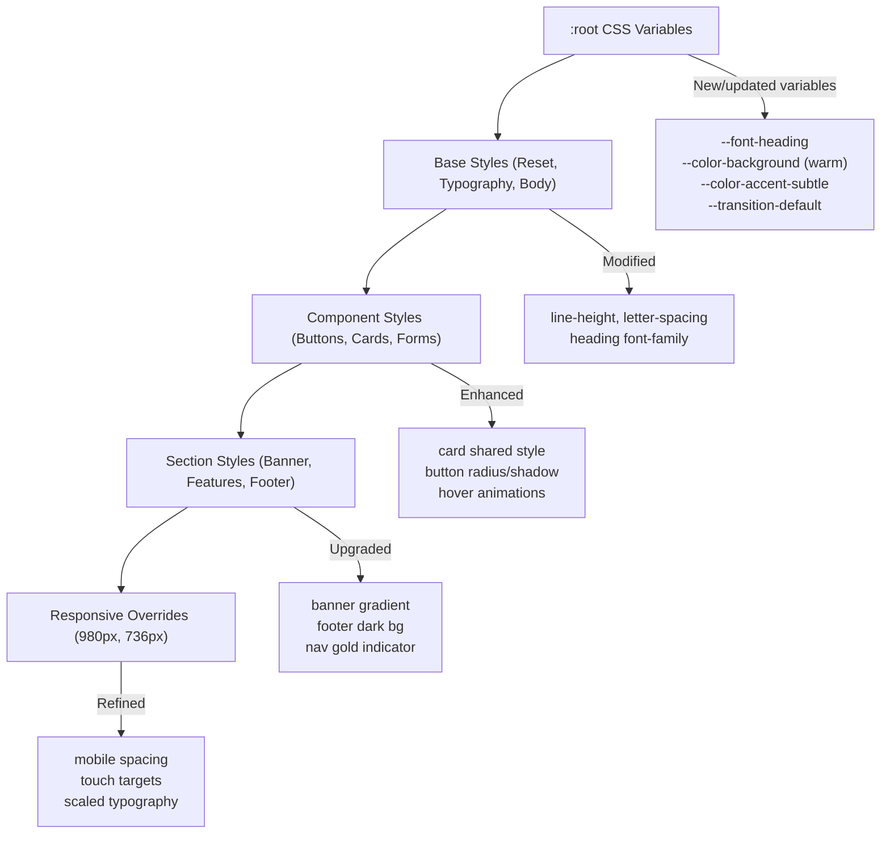

# Design Document: Design Upgrade

## Overview

This design covers a comprehensive visual refresh of the GAMEC community website, upgrading typography, color palette, component styling, spacing, animations, and accessibility — all within the existing HTML5/CSS3/jQuery architecture. The primary CSS file (`assets/css/main.css`, ~3,900 lines) already uses CSS custom properties, a 12-column flexbox grid, and responsive breakpoints. The upgrade leverages this architecture by modifying existing variables, adding new ones, and extending existing component selectors rather than restructuring the codebase.

The color scheme shifts from the current teal-green primary (#437D6F) with orange accent (#e67e22) — already partially migrated to navy (#001f3f) and gold (#d4af37) in the CSS variables — to a fully realized navy-and-gold palette with warm off-white backgrounds. A secondary heading font (serif/display from Google Fonts) is introduced for h1/h2 elements while Roboto remains for body text.

All changes target `assets/css/main.css` (and its `@import` for Google Fonts), `header.html`, and `footer.html`. No HTML page structure changes are required beyond the shared components. No new JavaScript is needed.

### Key Design Decisions

1. **CSS-only approach**: All visual changes are achieved through CSS modifications. No JavaScript changes required.
2. **Variable-first strategy**: New design tokens are added as CSS custom properties in `:root`, and existing variables are updated in place. This ensures all pages inherit changes automatically.
3. **Additive over destructive**: New selectors and properties are appended; existing grid, layout, and responsive breakpoint logic is preserved intact.
4. **Shared component updates**: `header.html` and `footer.html` markup changes are minimal (adding semantic classes or ARIA attributes where needed). The footer gets a structural wrapper for the dark background treatment.
5. **Google Fonts addition**: A serif/display heading font (e.g., Playfair Display or Merriweather) is added via the existing `@import` pattern.

## Architecture

The upgrade follows a layered modification strategy within the existing single-CSS-file architecture:



### Modification Zones in main.css

| CSS Section                | Line Range (approx.) | Changes                                         |
| -------------------------- | -------------------- | ----------------------------------------------- |
| 1. Imports & Fonts         | 1–25                 | Add heading font import                         |
| 2. Variables (:root)       | 27–100               | Update/add ~15 variables                        |
| 3. Reset & Base            | 100–230              | Update body line-height, letter-spacing         |
| 4. Typography              | 230–320              | Apply heading font, uppercase spacing on labels |
| 5. Buttons                 | 640–810              | Update radius, shadow, hover lift, alt variant  |
| 7. Common UI (Box/Feature) | 1050–1130            | Shared card style, hover effects                |
| 8. Page Sections           | 1200–1700            | Donation cards, program cards, benefit items    |
| 9. Site Structure          | 1700–1900            | Banner gradient, nav indicator, footer dark bg  |
| 10. Responsive             | 1900–end             | Mobile spacing, touch targets                   |

New CSS is appended at the end of relevant sections. A new section for animations/transitions and accessibility (focus indicators, prefers-reduced-motion) is added before the responsive overrides.

## Components and Interfaces

### 1. Design Token Layer (CSS Variables)

New and updated variables in `:root`:

```css
/* New variables */
--font-heading: "Playfair Display", Georgia, serif;
--color-accent-subtle: rgba(212, 175, 55, 0.12);
--transition-default: all 0.3s ease;
--shadow-card: 0 4px 16px var(--color-shadow-light);
--shadow-card-hover: 0 12px 28px var(--color-shadow-medium);
--radius-card: 10px;

/* Updated variables */
--color-background: #faf8f5; /* was #e8eef5 */
--color-background-light: #fdf9f3; /* warmer */
--color-background-alt: #f5efe6; /* warmer */
--color-background-section: #f8f4ed; /* warmer */
--color-text-light: #4a4a4a; /* was #555555, darker for WCAG */
--color-text-lighter: #525252; /* was #666666 */
--color-text-lightest: #5a5a5a; /* was #777777 */
```

### 2. Typography Component

- `@import` updated to include `Playfair Display:wght@400;700` (or chosen serif font)
- `h1, h2` receive `font-family: var(--font-heading)`
- Body `line-height` updated from `2.25em` to `1.8`
- Body `letter-spacing: 0.02em` added
- Widget `h3`, nav links, footer headings get `text-transform: uppercase; letter-spacing: 0.1em`

### 3. Shared Card Component

A unified card style applied to `.box.feature`, `.program-card`, `.benefit-item`, `.donation-section`, `.contact-card`:

```css
/* Shared card base */
background: var(--color-white);
border: 1px solid var(--color-border-light);
border-radius: var(--radius-card);
box-shadow: var(--shadow-card);
transition: var(--transition-default);

/* Shared card hover */
transform: translateY(-6px);
box-shadow: var(--shadow-card-hover);
border-top: 3px solid var(--color-accent);
```

### 4. Button System

- `border-radius: 8px` (from 6px)
- Default shadow: `0 4px 12px var(--color-shadow)`
- Hover: `translateY(-2px)` + `0 8px 20px var(--color-shadow-medium)`
- `.alt` variant: transparent bg, `2px solid var(--color-accent)` border, gold text → filled gold bg on hover
- Consistent padding: `0.7em 1.8em` (desktop), full-width on ≤980px

### 5. Banner Section

- Gradient overlay via `#banner::before` pseudo-element (navy to transparent)
- h1 gold underline via `#banner h1::after` pseudo-element
- Tagline `font-weight: 500`, `opacity: 0.88`
- Blockquote: `border-left: 4px solid var(--color-accent)`, serif italic font
- CTA buttons: `padding: 0.8em 2em`, `border-radius: 10px`

### 6. Navigation Bar

- Bottom border: `1px solid var(--color-border-light)` on `#header`
- Hover: `background: var(--color-accent-subtle)` (replacing white)
- Current page: gold `border-bottom: 3px solid var(--color-accent)` (replacing dark bg fill)
- Link text: `text-transform: uppercase; letter-spacing: 0.09em; font-size: 0.88em`
- Dropdown: `border-radius: 8px`, `box-shadow: 0 8px 16px var(--color-shadow-medium)`

### 7. Footer Component

- Dark navy background on `#footer-wrapper` using `--color-primary`
- Light text (`#f0f0f0`) for all footer content
- `h3` elements: gold color, uppercase, letter-spacing
- Links: light gray → gold on hover (0.25s transition)
- Social icons: `3em` size, circular `rgba(255,255,255,0.1)` bg → gold fill on hover
- Top decorative border: `4px solid var(--color-accent)` on `#footer-wrapper`
- `#copyright`: centered, `0.88em`, `opacity: 0.65`

### 8. Section Spacing

- `#features-wrapper` padding: `5em 0`
- `#main-wrapper` padding: `6em` (desktop)
- `.bottom-border` replaced with centered gold divider (70px × 2px)
- Section top margins: `3.5em` (except `:first-child`)
- Mobile (≤736px): spacing reduced ~35%

### 9. Animation System

- Consistent `transition: var(--transition-default)` on interactive elements
- `.more-link::after` pseudo-element: gold underline expanding from left (`scaleX(0)` → `scaleX(1)`)
- `@media (prefers-reduced-motion: reduce)`: disable all transforms and transitions

### 10. Accessibility Layer

- Focus indicator: `outline: 2px solid var(--color-accent); outline-offset: 2px` on all interactive elements
- Minimum font-size: `1rem` (16px) for body text enforced
- All new color combinations verified for WCAG 2.1 AA (4.5:1 normal text, 3:1 large text/UI)
- Decorative elements use `aria-hidden="true"` or are CSS-only (pseudo-elements)

### 11. Donation Page Enhancement

- Each `.donation-section` gets shared card style + colored left border (4px)
- Square: black left border; PayPal: #002c8b; Zelle: #6c1cd3
- h2 gets Font Awesome icon prefix via CSS `::before` or inline HTML icon
- Zelle ordered list: styled counter with gold circular badges
- CTA buttons use brand colors as backgrounds

### 12. Responsive Refinements

- ≤980px: logo max-width 120px, centered
- ≤736px: banner h1 2em, tagline 1.3em, padding 2em 1.5em
- ≤736px: cards stack full-width, 1.5em padding, 8px radius
- ≤736px: footer columns stack centered, 2em spacing
- Touch targets: minimum 44px × 44px on all interactive elements

## Data Models

This is a CSS-only design upgrade with no data persistence, APIs, or state management. There are no data models to define.

The "data" in this context is the set of CSS custom properties (design tokens) that parameterize the visual system. These are documented in the Components section above as the Design Token Layer.

## Correctness Properties

_A property is a characteristic or behavior that should hold true across all valid executions of a system — essentially, a formal statement about what the system should do. Properties serve as the bridge between human-readable specifications and machine-verifiable correctness guarantees._

Most acceptance criteria in this design upgrade are specific CSS value checks (examples) rather than universal properties. However, several criteria express rules that must hold across _all_ instances of a category (all headings, all card types, all color pairs, all interactive elements). These are the testable properties.

### Property 1: Heading font application

_For any_ h1 or h2 element rendered on any page, the computed `font-family` should resolve to the secondary heading font (the serif/display font defined in `--font-heading`), not Roboto.

**Validates: Requirements 1.1, 1.2, 1.6**

### Property 2: Editorial uppercase styling

_For any_ element in the set {widget h3, navigation link, footer heading}, the element should have `text-transform: uppercase` and `letter-spacing` between 0.08em and 0.15em.

**Validates: Requirements 1.5**

### Property 3: WCAG AA contrast compliance

_For any_ text color variable and background color variable pair used together in the design system, the computed contrast ratio should be at least 4.5:1 for normal text and 3:1 for large text, meeting WCAG 2.1 AA.

**Validates: Requirements 2.5, 2.6, 13.5**

### Property 4: Card component consistency

_For any_ card component type in the set {`.box.feature`, `.program-card`, `.benefit-item`, `.donation-section`, `.contact-card`}, the component should have: (a) white background, 1px solid border, border-radius between 10–12px, and a box-shadow using the shadow-light variable; (b) a hover state with `translateY(-6px)`, increased box-shadow, and a gold accent `border-top`; (c) internal padding between 2em and 2.5em; and (d) heading elements (h2, h3, h4) using the primary navy color and heading font family.

**Validates: Requirements 9.1, 9.2, 9.3, 9.4, 9.5**

### Property 5: Transition duration bounds

_For any_ CSS transition declaration in the stylesheet that applies to hover-interactive elements, the duration value should be between 0.2s and 0.4s.

**Validates: Requirements 10.5**

### Property 6: Touch target minimum size

_For any_ interactive element (button, link, or form input) at any viewport size, the element's computed clickable area (considering padding, min-height, min-width) should be at least 44px × 44px.

**Validates: Requirements 12.6**

### Property 7: Focus indicator on interactive elements

_For any_ interactive element (button, link, form input) in the design system, a `:focus-visible` or `:focus` rule should apply a visible outline of `2px solid` in the gold accent color with a `2px` offset.

**Validates: Requirements 13.1**

### Property 8: Minimum body text font-size

_For any_ body text element (p, li, td, span, label, input) across all viewport breakpoints, the computed `font-size` should be at least 16px (1rem).

**Validates: Requirements 13.3**

## Error Handling

This is a CSS-only visual upgrade with no runtime logic, API calls, or user input processing. Error handling is not applicable in the traditional sense.

However, the following defensive CSS strategies are employed:

1. **Fallback fonts**: The `--font-heading` variable includes a fallback chain (`'Playfair Display', Georgia, serif`) so headings render acceptably if Google Fonts fails to load.
2. **CSS variable fallbacks**: Critical properties use fallback values (e.g., `color: var(--color-primary, #001f3f)`) to handle cases where variables are undefined.
3. **Progressive enhancement for animations**: The `prefers-reduced-motion` media query disables transforms and transitions for users who need it, ensuring the site remains fully functional without animations.
4. **Graceful degradation for `aspect-ratio`**: Older browsers that don't support `aspect-ratio` will fall back to the natural image dimensions. The `object-fit: cover` still applies.
5. **Focus indicator visibility**: Using `outline` (not `box-shadow`) for focus indicators ensures they work across all browsers and aren't clipped by `overflow: hidden` containers.

## Testing Strategy

### Visual / Manual Testing

Since this is a CSS design upgrade, the primary testing method is visual inspection across:

- All 16 HTML pages + 2 shared components
- 4 viewport breakpoints: desktop (>1280px), xlarge (1281–1680px), large (981–1280px), medium (737–980px), small (≤736px)
- Light and dark system themes (for `prefers-reduced-motion` and `prefers-color-scheme` if applicable)
- Keyboard navigation (focus indicator visibility)
- Screen reader pass (decorative elements don't interfere)

### Unit Tests (Example-Based)

Unit tests verify specific CSS values and rules are correctly applied. These cover the majority of acceptance criteria that are specific value checks (not universal properties).

Key example tests:

- Verify `--color-background` is `#FAF8F5` (not `#e8eef5`)
- Verify `--color-primary` remains `#001f3f` and `--color-accent` remains `#d4af37`
- Verify `--color-accent-subtle` variable exists in `:root`
- Verify `#banner` has gradient overlay styles
- Verify `.button` has `border-radius: 8px`
- Verify `.button.alt` has transparent background with gold border
- Verify `#footer-wrapper` has dark navy background and gold top border
- Verify `.bottom-border` uses centered gold divider (not double border)
- Verify `@media (prefers-reduced-motion: reduce)` rule exists
- Verify `.more-link::after` has `scaleX` transform for underline animation
- Verify donation sections have colored left borders matching brand colors
- Verify responsive breakpoint values for banner, cards, footer at ≤736px

These tests can be implemented by parsing the CSS file content and asserting on property values, or by using a headless browser (e.g., Puppeteer/Playwright) to check computed styles.

### Property-Based Tests

Property-based tests verify universal properties that must hold across all instances. Each test should run a minimum of 100 iterations.

The property-based testing library for this project should be **fast-check** (JavaScript), since the project uses a JS ecosystem and tests can parse CSS or query computed styles via a headless browser.

Each property test must be tagged with a comment referencing the design property:

- **Feature: design-upgrade, Property 1: Heading font application** — Generate random page URLs from the 16 pages, load each, query all h1/h2 elements, assert computed font-family includes the heading font.
- **Feature: design-upgrade, Property 2: Editorial uppercase styling** — For each element in {widget h3, nav link, footer h3}, assert text-transform is uppercase and letter-spacing is in [0.08em, 0.15em].
- **Feature: design-upgrade, Property 3: WCAG AA contrast compliance** — Generate all text-color/background-color variable pairs from :root, compute contrast ratios, assert ≥4.5:1 (normal) or ≥3:1 (large text).
- **Feature: design-upgrade, Property 4: Card component consistency** — For each card selector in the set, parse CSS rules and assert shared base styles (bg, border, radius, shadow) and hover states (translateY, shadow, border-top) are present with correct values.
- **Feature: design-upgrade, Property 5: Transition duration bounds** — Parse all `transition` declarations in the CSS, extract duration values, assert each is between 0.2s and 0.4s.
- **Feature: design-upgrade, Property 6: Touch target minimum size** — For each interactive element type at each breakpoint, compute the effective clickable area and assert ≥44px in both dimensions.
- **Feature: design-upgrade, Property 7: Focus indicator on interactive elements** — For each interactive element type, assert a :focus or :focus-visible rule exists with outline: 2px solid gold and outline-offset: 2px.
- **Feature: design-upgrade, Property 8: Minimum body text font-size** — For each body text element type at each breakpoint, assert computed font-size ≥ 16px.

### Testing Tools

- **CSS parsing**: Use a CSS parser (e.g., `css-tree` or `postcss`) to programmatically inspect rules and values
- **Computed styles**: Use Playwright or Puppeteer to load pages and query `getComputedStyle()` for runtime verification
- **Contrast checking**: Use a contrast ratio calculation function (relative luminance formula per WCAG 2.1)
- **fast-check**: Property-based testing library for generating test inputs and running 100+ iterations
