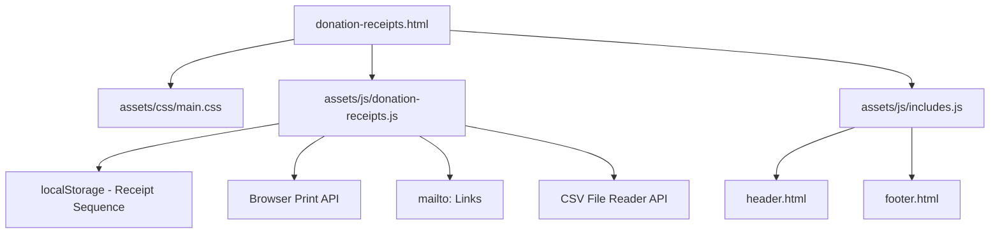

# Design Document: Donation Invoice System

## Overview

The Donation Invoice System is a client-side receipt generator page (`donation-receipts.html`) for GAMEC administrators. It allows generating IRS-compliant, branded donation receipts from either manual single-entry or CSV bulk import. The system runs entirely in the browser with no backend, persists receipt sequence numbers in `localStorage`, and produces print/PDF-ready output on US Letter paper. It is an internal-only tool — unlisted, not indexed, and not linked from any public page.

The page follows the existing GAMEC site architecture: it loads the shared header/footer via `includes.js`, uses the existing `main.css` design system (navy/gold palette, Roboto font, Playfair Display headings), and adds a dedicated `donation-receipts.js` module for all receipt logic.

## Architecture

The system is a single HTML page with one supporting JavaScript module. There is no backend, no database, and no build step.



### Key Architectural Decisions

1. **Single JS module** (`assets/js/donation-receipts.js`): All receipt logic — form handling, CSV parsing, receipt rendering, sequence management, print, and mailto — lives in one file. The site doesn't use a bundler, so this keeps things simple and consistent with the existing pattern (e.g., `quran-viewer.js`).

2. **No external CSV library**: The CSV format for this use case is simple and well-defined (6-7 columns, no nested quotes expected). A lightweight custom parser is sufficient and avoids adding dependencies.

3. **Print via `window.print()`**: A `@media print` stylesheet hides the form/nav and shows only receipt content. Each receipt gets a `page-break-after: always` rule for multi-receipt printing. Users save as PDF through the browser's native "Save as PDF" print option.

4. **localStorage for sequence numbers**: The receipt counter is stored as a JSON object keyed by year (`{ "2025": 42 }`), allowing independent sequences per year. This survives page reloads and is consistent with the "no backend" constraint.

5. **Receipts rendered as DOM elements**: Receipts are generated as HTML `<section>` elements injected into a `#receipt-output` container. This makes them printable, styleable, and easy to target for individual actions (email buttons, etc.).

## Components and Interfaces

### 1. HTML Page (`donation-receipts.html`)

The page structure follows the existing GAMEC pattern (see `membership.html`, `donate.html`):

- `<meta name="robots" content="noindex, nofollow">` — prevents search indexing
- No canonical URL, no sitemap entry, no OG tags (internal page)
- Shared header/footer wrappers loaded by `includes.js`
- "Internal Use Only — GAMEC Administration" banner at top of content area

**Page sections:**

- Internal-use notice banner
- Year selector (dropdown, defaults to current year)
- Receipt number management (display current next number, field to override)
- Tab-style toggle: "Single Entry" | "CSV Import"
- Single entry form (name, address, amount, date, payment method, email, memo)
- CSV upload area (file input + preview table)
- Action buttons (Generate, Print All, Clear)
- Receipt output container (`#receipt-output`)

### 2. JavaScript Module (`assets/js/donation-receipts.js`)

Exposes the following functions (all module-scoped, not global, except init):

| Function                                          | Purpose                                                                              |
| ------------------------------------------------- | ------------------------------------------------------------------------------------ |
| `initReceiptGenerator()`                          | Entry point called on DOMContentLoaded. Binds all event listeners.                   |
| `validateForm(formData)`                          | Validates a single donor record. Returns `{ valid, errors }`.                        |
| `parseCSV(text)`                                  | Parses CSV string into array of donor record objects. Returns `{ records, errors }`. |
| `renderPreviewTable(records, errors)`             | Renders CSV preview table with error highlighting into DOM.                          |
| `generateReceipt(donorRecord, year, sequenceNum)` | Creates a receipt DOM element from a donor record. Returns the element.              |
| `formatReceiptNumber(year, seq)`                  | Returns formatted string `GAMEC-YYYY-NNNN`.                                          |
| `getNextSequence(year)`                           | Reads localStorage, returns next sequence number for given year.                     |
| `setSequence(year, num)`                          | Writes sequence number to localStorage for given year.                               |
| `buildMailtoLink(email, receiptNumber)`           | Returns a `mailto:` URL string with pre-filled subject and body.                     |
| `formatCurrency(amount)`                          | Formats a number as USD currency string (e.g., `$1,250.00`).                         |
| `filterByYear(records, year)`                     | Filters donor records to those whose donation date falls in the given year.          |

### 3. Print Stylesheet (embedded `<style media="print">` or `@media print` block)

Hides: header, footer, nav, form sections, action buttons, internal-use banner.
Shows: `#receipt-output` only.
Applies: `page-break-after: always` on each `.receipt` element, US Letter sizing.

## Data Models

### DonorRecord

```javascript
{
  name: string,          // Required. Donor full name.
  address: string,       // Required. Donor mailing address.
  amount: number,        // Required. Donation amount in USD (positive number).
  date: string,          // Required. Donation date in YYYY-MM-DD format.
  paymentMethod: string, // Required. One of: "Square", "PayPal", "Zelle".
  email: string,         // Optional. Donor email address.
  memo: string           // Optional. Purpose/memo for the donation.
}
```

### ReceiptData (extends DonorRecord for rendering)

```javascript
{
  ...DonorRecord,
  receiptNumber: string, // e.g., "GAMEC-2025-0001"
  year: number,          // Tax year from the year selector
}
```

### localStorage Schema

Key: `gamec-receipt-sequences`

```javascript
{
  "2024": 15,   // Last used sequence number for 2024
  "2025": 3     // Last used sequence number for 2025
}
```

### CSV Format

```
name,address,amount,date,paymentMethod,email,memo
"John Doe","123 Main St, City, ST 12345",100.00,2025-01-15,PayPal,john@example.com,Annual donation
```

- First row is treated as a header row (skipped)
- Columns: name, address, amount, date, paymentMethod, email (optional), memo (optional)
- Standard CSV quoting rules (double-quote fields containing commas)

## Correctness Properties

_A property is a characteristic or behavior that should hold true across all valid executions of a system — essentially, a formal statement about what the system should do. Properties serve as the bridge between human-readable specifications and machine-verifiable correctness guarantees._

### Property 1: Form validation rejects invalid donor records

_For any_ donor record object where at least one required field (name, address, amount, date, paymentMethod) is empty or where paymentMethod is not one of "Square", "PayPal", or "Zelle", `validateForm` should return `{ valid: false }` with an errors array identifying each invalid field.

**Validates: Requirements 1.3, 1.4**

### Property 2: Valid form data produces a receipt

_For any_ donor record with all required fields populated (non-empty name, non-empty address, positive numeric amount, valid date string, and paymentMethod in {"Square", "PayPal", "Zelle"}), `validateForm` should return `{ valid: true }` and `generateReceipt` should return a non-null DOM element containing the donor's information.

**Validates: Requirements 1.2**

### Property 3: CSV round-trip parsing

_For any_ array of valid donor records, serializing them to CSV format (with header row) and then parsing with `parseCSV` should produce an equivalent array of records with the same field values and the same count.

**Validates: Requirements 2.1, 2.2**

### Property 4: CSV validation catches rows with missing required fields

_For any_ CSV string containing rows where one or more required fields are empty, `parseCSV` should return those rows in its errors array with descriptive messages identifying the missing fields.

**Validates: Requirements 2.3**

### Property 5: Receipt count matches donor record count

_For any_ array of N valid donor records (N ≥ 1), generating receipts for all of them should produce exactly N receipt DOM elements in the output container.

**Validates: Requirements 2.5**

### Property 6: Receipt contains all required static content

_For any_ generated receipt (from any valid donor record), the receipt HTML should contain: (a) an `` with src including "logo-circle.png", (b) the text "GAMEC Inc.", (c) "3420 13th St SE, Washington, DC 20032", (d) "+1 (202) 440-9089", (e) the tax disclosure text "No goods or services were provided in exchange for this contribution", and (f) the text "Authorized Signature".

**Validates: Requirements 3.1, 3.2, 3.3, 3.4, 3.7, 3.8**

### Property 7: Receipt number format

_For any_ year (2000–2099) and any sequence number (1–9999), `formatReceiptNumber(year, seq)` should return a string matching the pattern `GAMEC-YYYY-NNNN` where YYYY is the year and NNNN is the zero-padded sequence number.

**Validates: Requirements 3.5**

### Property 8: Receipt contains donor-specific content and tax year

_For any_ valid donor record and selected year, the generated receipt should contain: the donor's full name, the donor's address, the donation amount formatted as USD currency, the donation date, the payment method, and the text "Donation Receipt for Tax Year YYYY". If a memo is provided, the receipt should also contain the memo text in a "Purpose" section.

**Validates: Requirements 3.6, 3.9, 9.3**

### Property 9: Sequence number increment and persistence

_For any_ year and starting sequence number N (stored in localStorage), calling `getNextSequence(year)` should return N+1, and after the call, localStorage should contain N+1 as the last used sequence for that year.

**Validates: Requirements 5.1, 5.2**

### Property 10: Manual sequence override

_For any_ year and any manually set number M, after calling `setSequence(year, M-1)`, the next call to `getNextSequence(year)` should return M, and subsequent calls should return M+1, M+2, etc.

**Validates: Requirements 5.4**

### Property 11: Email button presence based on donor email

_For any_ donor record, if the record has a non-empty email field, the generated receipt should contain an "Email to Donor" button/link. If the email field is empty or absent, no such button should appear.

**Validates: Requirements 8.2, 8.5**

### Property 12: Mailto link correctness

_For any_ donor email address and receipt number, `buildMailtoLink(email, receiptNumber)` should return a string starting with `mailto:` that contains the email in the "to" field, a subject containing the receipt number, a body containing a thank-you message, and a reminder to attach the PDF.

**Validates: Requirements 8.3, 8.4**

### Property 13: Year filtering

_For any_ array of donor records with dates spanning multiple years and any selected year Y, `filterByYear(records, Y)` should return only records whose donation date falls within year Y, and the count should equal the number of input records with dates in year Y.

**Validates: Requirements 9.2**

### Property 14: Currency formatting

_For any_ positive number, `formatCurrency(amount)` should return a string starting with "$", containing commas for thousands separators, and exactly two decimal places.

**Validates: Requirements 3.6**

## Error Handling

| Scenario                                          | Behavior                                                                                                              |
| ------------------------------------------------- | --------------------------------------------------------------------------------------------------------------------- |
| Required form field empty                         | Inline validation error next to the field. Form does not submit.                                                      |
| Payment method not in allowed set                 | Validation error on payment method field. (Prevented by `<select>` in UI, but validated in JS too.)                   |
| Invalid amount (non-numeric, negative, zero)      | Validation error: "Please enter a valid donation amount."                                                             |
| Invalid date format                               | Validation error: "Please enter a valid date."                                                                        |
| CSV file unreadable / wrong format                | Error banner: "Unable to read the CSV file. Please ensure it is a valid CSV with the expected columns."               |
| CSV row missing required fields                   | Row highlighted in red in preview table with per-field error messages. Row excluded from generation unless corrected. |
| CSV with no valid rows                            | Error banner: "No valid donor records found in the uploaded file."                                                    |
| localStorage unavailable                          | Graceful fallback: sequence starts at 1, warning displayed that numbers won't persist.                                |
| Empty receipt output container when Print clicked | Alert: "No receipts to print. Please generate receipts first."                                                        |

All errors are displayed in the UI — no `alert()` dialogs except for the print edge case. Validation errors use the existing GAMEC form styling (border-color change + error text below field).

## Testing Strategy

### Testing Framework

- **Test runner**: Vitest (already configured in `package.json` with `vitest --run`)
- **Property-based testing**: fast-check (already installed as devDependency)
- **Test file location**: `tests/` directory (consistent with existing tests)

### Unit Tests (`tests/donation-receipts.unit.test.mjs`)

Unit tests cover specific examples and edge cases:

- Form renders with all required fields (Req 1.1)
- Print button exists (Req 4.1)
- Sequence number override field exists (Req 5.3)
- Year selector defaults to current year (Req 9.1)
- Internal-use notice banner present (Req 7.4)
- Meta robots tag is "noindex, nofollow" (Req 7.3)
- Receipt page not in sitemap.xml (Req 7.2)
- Receipt page not linked from navigation/footer (Req 7.1)
- Donor email field exists in form (Req 8.1)
- Completely invalid CSV input returns error (Req 2.4 — edge case)
- Empty string CSV returns error (edge case)
- localStorage unavailable fallback (edge case)

### Property-Based Tests (`tests/donation-receipts.property.test.mjs`)

Each property test runs a minimum of 100 iterations and references its design property.

| Test                               | Property    | Tag                                                                                                    |
| ---------------------------------- | ----------- | ------------------------------------------------------------------------------------------------------ |
| Validation rejects invalid records | Property 1  | Feature: donation-invoice-system, Property 1: Form validation rejects invalid donor records            |
| Valid data produces receipt        | Property 2  | Feature: donation-invoice-system, Property 2: Valid form data produces a receipt                       |
| CSV round-trip                     | Property 3  | Feature: donation-invoice-system, Property 3: CSV round-trip parsing                                   |
| CSV validation                     | Property 4  | Feature: donation-invoice-system, Property 4: CSV validation catches rows with missing required fields |
| Receipt count                      | Property 5  | Feature: donation-invoice-system, Property 5: Receipt count matches donor record count                 |
| Static content                     | Property 6  | Feature: donation-invoice-system, Property 6: Receipt contains all required static content             |
| Receipt number format              | Property 7  | Feature: donation-invoice-system, Property 7: Receipt number format                                    |
| Donor content                      | Property 8  | Feature: donation-invoice-system, Property 8: Receipt contains donor-specific content and tax year     |
| Sequence increment                 | Property 9  | Feature: donation-invoice-system, Property 9: Sequence number increment and persistence                |
| Sequence override                  | Property 10 | Feature: donation-invoice-system, Property 10: Manual sequence override                                |
| Email button                       | Property 11 | Feature: donation-invoice-system, Property 11: Email button presence based on donor email              |
| Mailto link                        | Property 12 | Feature: donation-invoice-system, Property 12: Mailto link correctness                                 |
| Year filtering                     | Property 13 | Feature: donation-invoice-system, Property 13: Year filtering                                          |
| Currency formatting                | Property 14 | Feature: donation-invoice-system, Property 14: Currency formatting                                     |

Each property-based test must be implemented as a SINGLE `fc.assert(fc.property(...))` call with `{ numRuns: 100 }` minimum. Generators will produce random donor records, CSV strings, years, sequence numbers, email addresses, and amounts as needed.
