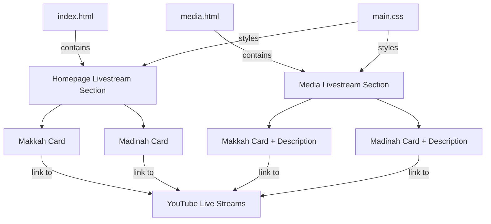

# Design Document: Holy Cities Livestream

## Overview

This feature adds a "Live from the Holy Cities" section to both the homepage (`index.html`) and media page (`media.html`) of the GAMEC website. Each section displays two visually polished livestream cards — one for Makkah and one for Madinah — with city images, headings, optional descriptions, and CTA buttons linking to YouTube live streams.

The design prioritizes visual polish: smooth hover transitions, elegant card layouts with the existing GAMEC shadow/radius system, and a cohesive look that matches the site's Navy + Gold aesthetic. The implementation is pure HTML + CSS, requiring no JavaScript, and integrates directly into the existing grid system and design tokens.

## Architecture

The feature is a static HTML/CSS addition with no backend or JavaScript dependencies.



### Key Design Decisions

1. **CSS-only approach** — No JavaScript needed. Cards are anchor-wrapped or contain anchor CTAs. Hover effects use CSS transitions already established in the design system.
2. **Reuse existing design tokens** — All shadows, radii, colors, and transitions use CSS variables from `:root` (e.g., `--shadow-card`, `--radius-card`, `--transition-default`).
3. **CSS Grid for card layout** — A two-column grid with `grid-template-columns: repeat(2, 1fr)` collapses to `1fr` at ≤736px. This matches the site's existing responsive patterns.
4. **Styles in main.css** — New styles are appended to `assets/css/main.css` in the existing page-specific sections area, keeping all styles in one file consistent with the project convention.
5. **Shared card class** — Both homepage and media page cards use the same `.livestream-card` class. The media page adds `.livestream-card--detailed` modifier for the description text variant.

## Components and Interfaces

### HTML Components

#### 1. Livestream Section Container (`.livestream-section`)

Wraps the heading, optional intro paragraph, and the card grid. Used on both pages.

```html
<section class="livestream-section">
  <h2>Live from the Holy Cities</h2>
  <!-- optional intro paragraph on media page -->
  <div class="livestream-grid">
    <!-- cards here -->
  </div>
</section>
```

#### 2. Livestream Card (`.livestream-card`)

Each card contains an image, heading, optional description, and CTA button.

```html
<div class="livestream-card">
  <div class="livestream-card__image">
    
    <span class="livestream-card__live-badge">
      <i class="fas fa-circle"></i> Live
    </span>
  </div>
  <div class="livestream-card__body">
    <h3>Makkah</h3>
    <!-- description paragraph only on media page -->
    <a
      href="https://www.youtube.com/live/JRRtm-adKvc?si=TmUeIlhqXGG3rRYI"
      class="button icon solid fa-video"
      target="_blank"
      rel="noopener noreferrer"
    >
      Watch Live <span class="visually-hidden">(opens in new tab)</span>
    </a>
  </div>
</div>
```

#### 3. Homepage Placement

The section is inserted in `index.html` inside `#main-wrapper > .container`, between the "Stay Connected" section and the end of main content (or between "Community Groups" and "Stay Connected" — whichever provides the best visual flow).

#### 4. Media Page Placement

The section is inserted in `media.html` inside `#content`, between the Photo Gallery `<div class="bottom-border"></div>` and the Video Production section, with its own `<div class="bottom-border"></div>` separator after it.

### CSS Components

#### Card Grid (`.livestream-grid`)

```css
.livestream-grid {
  display: grid;
  grid-template-columns: repeat(2, 1fr);
  gap: 2rem;
  margin-top: 2rem;
}
```

#### Card Base (`.livestream-card`)

```css
.livestream-card {
  background: var(--color-white);
  border-radius: var(--radius-card);
  box-shadow: var(--shadow-card);
  border: 1px solid var(--color-border-light);
  overflow: hidden;
  transition:
    transform 0.3s ease,
    box-shadow 0.3s ease;
}

.livestream-card:hover {
  transform: translateY(-4px);
  box-shadow: var(--shadow-card-hover);
}
```

#### Card Image Container (`.livestream-card__image`)

```css
.livestream-card__image {
  position: relative;
  overflow: hidden;
}

.livestream-card__image img {
  width: 100%;
  aspect-ratio: 16 / 9;
  object-fit: cover;
  display: block;
  transition: transform 0.4s ease;
}

.livestream-card:hover .livestream-card__image img {
  transform: scale(1.03);
}
```

#### Live Badge (`.livestream-card__live-badge`)

A small "Live" indicator overlaid on the image corner for visual flair.

```css
.livestream-card__live-badge {
  position: absolute;
  top: 0.75rem;
  left: 0.75rem;
  background: rgba(220, 38, 38, 0.9);
  color: #fff;
  font-size: 0.75rem;
  font-weight: 700;
  text-transform: uppercase;
  letter-spacing: 0.05em;
  padding: 0.3em 0.7em;
  border-radius: 4px;
  display: flex;
  align-items: center;
  gap: 0.35em;
}

.livestream-card__live-badge i {
  font-size: 0.5em;
  animation: live-pulse 1.5s ease-in-out infinite;
}

@keyframes live-pulse {
  0%,
  100% {
    opacity: 1;
  }
  50% {
    opacity: 0.4;
  }
}
```

#### Card Body (`.livestream-card__body`)

```css
.livestream-card__body {
  padding: 1.5rem 1.5rem 1.75rem;
  text-align: center;
}

.livestream-card__body h3 {
  font-family: var(--font-heading);
  font-size: 1.5rem;
  color: var(--color-primary);
  margin: 0 0 0.5rem;
}

.livestream-card__body p {
  color: var(--color-text-medium);
  font-size: 1rem;
  line-height: 1.6;
  margin: 0 0 1.25rem;
}

.livestream-card__body .button {
  font-size: 1rem;
}
```

#### Responsive Breakpoints

```css
/* Medium (737px–980px): maintain 2-col with tighter gap */
@media screen and (max-width: 980px) {
  .livestream-grid {
    gap: 1.5rem;
  }
}

/* Small (≤736px): single column stack */
@media screen and (max-width: 736px) {
  .livestream-grid {
    grid-template-columns: 1fr;
    gap: 1.5rem;
  }

  .livestream-card__body {
    padding: 1.25rem 1.25rem 1.5rem;
  }

  .livestream-card__body h3 {
    font-size: 1.3rem;
  }
}
```

#### Reduced Motion

```css
@media (prefers-reduced-motion: reduce) {
  .livestream-card,
  .livestream-card__image img,
  .livestream-card__live-badge i {
    transition: none !important;
    animation: none !important;
    transform: none !important;
  }
}
```

## Data Models

No dynamic data models are required. All content is static HTML:

| Field                         | Makkah                                                                                   | Madinah                                                                                            |
| ----------------------------- | ---------------------------------------------------------------------------------------- | -------------------------------------------------------------------------------------------------- |
| Image                         | `images/kaaba2.jpg`                                                                      | `images/madinah.jpeg`                                                                              |
| Alt Text                      | "Live stream from Makkah - The Holy Kaaba"                                               | "Live stream from Madinah - The Prophet's Mosque"                                                  |
| Heading                       | "Makkah"                                                                                 | "Madinah"                                                                                          |
| Description (media page only) | "Watch the live broadcast from the Holy Kaaba in Makkah, the most sacred site in Islam." | "Watch the live broadcast from the Prophet's Mosque in Madinah, the second holiest site in Islam." |
| Stream URL                    | `https://www.youtube.com/live/JRRtm-adKvc?si=TmUeIlhqXGG3rRYI`                           | `https://www.youtube.com/live/dFMegZR036Y?si=99vM0eFVKZefJaM0`                                     |

## Correctness Properties

_A property is a characteristic or behavior that should hold true across all valid executions of a system — essentially, a formal statement about what the system should do. Properties serve as the bridge between human-readable specifications and machine-verifiable correctness guarantees._

### Property 1: Card content correctness

_For any_ livestream card rendered on any page, the card SHALL contain an `` element whose `src` matches the designated city image path and whose `alt` attribute matches the designated descriptive alt text, and a heading element whose text content matches the designated city name ("Makkah" or "Madinah").

**Validates: Requirements 3.1, 3.2, 4.1, 4.2**

### Property 2: CTA button link integrity

_For any_ CTA button within a livestream card, the anchor element SHALL have an `href` matching the designated YouTube stream URL for that city, a `target` attribute of `"_blank"`, a `rel` attribute containing both `"noopener"` and `"noreferrer"`, text content including `"Watch Live"`, and a Font Awesome video icon class (`fa-video`).

**Validates: Requirements 3.3, 3.4, 3.5, 3.6, 4.3, 4.4, 4.5, 4.6**

### Property 3: Card visual design consistency

_For any_ livestream card element, the computed CSS SHALL include `border-radius` matching the `--radius-card` variable value, `box-shadow` matching the `--shadow-card` variable value in default state, `box-shadow` matching `--shadow-card-hover` on hover state, and a white `background-color`.

**Validates: Requirements 5.1, 5.2, 5.3, 5.6**

### Property 4: Image responsive behavior and attributes

_For any_ livestream card image element, the element SHALL have `loading="lazy"`, a non-empty `alt` attribute, `object-fit: cover` in computed styles, and `width: 100%` of its container, ensuring proportional scaling without distortion.

**Validates: Requirements 5.4, 6.1, 6.2, 7.2**

### Property 5: CTA button accessibility

_For any_ CTA button anchor within a livestream card, the element SHALL be natively keyboard-focusable (i.e., an `<a>` element with `href`), use the site's primary `.button` class, and contain an accessible indication that the link opens in a new tab (via a visually-hidden `<span>` with text "(opens in new tab)" or equivalent `aria-label`).

**Validates: Requirements 5.5, 7.1, 7.3**

## Error Handling

Since this feature is entirely static HTML/CSS with no JavaScript logic, dynamic data fetching, or user input processing, error handling is minimal:

1. **Broken YouTube links** — If a YouTube live stream URL becomes invalid or the stream goes offline, the user will see YouTube's standard "video unavailable" page. No application-level error handling is needed. The CTA button text says "Watch Live" which is accurate regardless of stream status.

2. **Missing images** — If `images/kaaba2.jpg` or `images/madinah.jpeg` are missing, the `alt` text provides a meaningful fallback. The card layout remains intact because the image container has a fixed aspect ratio via `aspect-ratio: 16/9`.

3. **CSS variable fallback** — If CSS custom properties fail to load (extremely unlikely in modern browsers), the card will still render with browser defaults. The `border-radius`, `box-shadow`, and `background` properties degrade gracefully.

4. **Reduced motion** — Users with `prefers-reduced-motion: reduce` will see no hover animations or the live-pulse animation, ensuring accessibility for motion-sensitive users.

## Testing Strategy

### Unit Tests (Example-Based)

Unit tests verify specific, concrete behaviors:

- **Homepage section exists**: Verify `index.html` contains a `.livestream-section` with heading text "Live from the Holy Cities" inside `#main-wrapper`.
- **Media page section exists**: Verify `media.html` contains a `.livestream-section` inside `#content`, positioned between the Photo Gallery and Video Production sections.
- **Media page has intro paragraph**: Verify the media page's `.livestream-section` contains an introductory `<p>` element before the card grid.
- **Media page cards have descriptions**: Verify each `.livestream-card` on the media page contains a description `<p>` in `.livestream-card__body`.
- **Responsive stacking at ≤736px**: Verify the CSS rule for `.livestream-grid` at `max-width: 736px` sets `grid-template-columns: 1fr`.
- **Medium breakpoint maintains two columns**: Verify no CSS rule between 737px–980px changes `.livestream-grid` to single column.
- **Heading hierarchy**: Verify the section heading is `<h2>` and card headings are `<h3>`, consistent with surrounding page structure.

### Property-Based Tests

Property-based tests use randomized inputs to verify universal properties. The testing library should be **fast-check** (JavaScript PBT library), with a minimum of 100 iterations per test.

Each property test must be tagged with a comment referencing the design property:

- **Feature: holy-cities-livestream, Property 1: Card content correctness** — Generate random page selections (homepage or media), parse the HTML, and verify every `.livestream-card` contains the correct image `src`, `alt`, and heading text for its designated city.

- **Feature: holy-cities-livestream, Property 2: CTA button link integrity** — For all `.livestream-card` elements across all pages, verify each CTA anchor has the correct `href`, `target="_blank"`, `rel="noopener noreferrer"`, "Watch Live" text, and `fa-video` class.

- **Feature: holy-cities-livestream, Property 3: Card visual design consistency** — For all `.livestream-card` elements, parse the CSS and verify the rules include `border-radius` using `var(--radius-card)`, `box-shadow` using `var(--shadow-card)`, hover rule with `var(--shadow-card-hover)`, and white background.

- **Feature: holy-cities-livestream, Property 4: Image responsive behavior and attributes** — For all `img` elements within `.livestream-card`, verify `loading="lazy"`, non-empty `alt`, and CSS rules specifying `object-fit: cover` and `width: 100%`.

- **Feature: holy-cities-livestream, Property 5: CTA button accessibility** — For all CTA anchors within `.livestream-card`, verify the element is an `<a>` tag with `href`, has the `.button` class, and contains a mechanism communicating new-tab behavior (visually-hidden span or aria-label).
