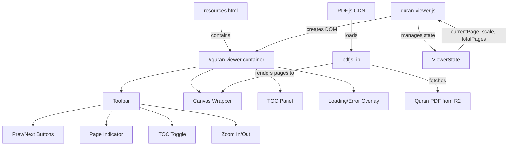

# Design Document: Quran PDF Viewer

## Overview

This feature embeds an interactive Quran PDF viewer into the GAMEC `resources.html` page, replacing the existing static Quran image. The viewer uses Mozilla's PDF.js library (loaded via CDN) to render PDF pages onto an HTML canvas, providing page navigation, a surah-based table of contents, zoom controls, and keyboard accessibility. The implementation is a single self-contained JavaScript file (`assets/js/quran-viewer.js`) with styles appended to `assets/css/main.css`, requiring no build tools or frameworks beyond the existing jQuery and Font Awesome already on the site.

The PDF is hosted on Cloudflare R2 at `https://pub-859f42e20e3a4f7bb6787dd54417300a.r2.dev/quran.pdf` with CORS configured for `igamec.org` and `localhost:3000`.

## Architecture

The viewer follows a simple MVC-like pattern within a single JS file:



The architecture has three layers:

1. **State Management** — A plain object (`ViewerState`) tracks `currentPage`, `scale`, `totalPages`, `pdfDoc` reference, and `tocOpen` flag. All mutations go through a central `renderPage()` function.
2. **DOM Construction** — On `DOMContentLoaded`, the script finds the existing Quran image block, replaces it with the viewer container, and builds the toolbar, canvas wrapper, TOC panel, and overlays programmatically.
3. **PDF.js Integration** — PDF.js is loaded via CDN `<script>` tag added to `resources.html`. The viewer calls `pdfjsLib.getDocument()` to load the PDF, then `page.render()` for each page navigation.

## Components and Interfaces

### 1. QuranViewer (Main Module)

The entry point exported from `quran-viewer.js`. Initializes when the DOM is ready.

```
initQuranViewer()
  - Locates the existing Quran image block in the DOM
  - Replaces it with the viewer container
  - Loads the PDF via pdfjsLib.getDocument(pdfUrl)
  - Renders page 1
  - Attaches event listeners
```

### 2. ViewerState

A plain state object — not a class, just a module-scoped object:

```javascript
{
  pdfDoc: null,        // PDFDocumentProxy from PDF.js
  currentPage: 1,      // Currently displayed page (1-indexed)
  totalPages: 0,       // Total page count from PDF
  scale: null,         // Current zoom scale (null = fit-to-width)
  rendering: false,    // Lock to prevent concurrent renders
  tocOpen: false       // Whether TOC panel is visible
}
```

### 3. Toolbar

A horizontal bar above the canvas containing:

| Element        | Type       | aria-label          | Action                      |
| -------------- | ---------- | ------------------- | --------------------------- |
| Prev button    | `<button>` | "Previous page"     | `goToPage(currentPage - 1)` |
| Page indicator | `<span>`   | —                   | Displays "Page X of Y"      |
| Next button    | `<button>` | "Next page"         | `goToPage(currentPage + 1)` |
| TOC toggle     | `<button>` | "Table of contents" | Toggles TOC panel           |
| Zoom out       | `<button>` | "Zoom out"          | `adjustZoom(-0.25)`         |
| Zoom in        | `<button>` | "Zoom in"           | `adjustZoom(+0.25)`         |

### 4. TOC Panel

An overlay/dropdown listing all 114 surahs. Each entry is a `<button>` with the surah name and page number. Clicking navigates to that page and closes the panel. The panel is scrollable and highlights the current surah.

### 5. Canvas Wrapper

Contains the `<canvas>` element where PDF.js renders pages. The canvas is wrapped in a `<div>` that handles overflow when zoomed in. The canvas has `role="img"` and an `aria-label` describing the current page.

### 6. Loading/Error Overlay

- **Loading state**: A spinner overlay shown while the PDF document is being fetched.
- **Error state**: An error message with a "Retry" button, shown if the PDF fails to load.

### Key Functions

```
renderPage(pageNum)
  - Sets rendering lock
  - Gets page from pdfDoc
  - Calculates viewport based on scale (or fit-to-width if scale is null)
  - Sets canvas dimensions
  - Calls page.render()
  - Updates page indicator, button disabled states, aria-live region, TOC highlight

goToPage(pageNum)
  - Validates pageNum is within [1, totalPages]
  - Updates currentPage
  - Calls renderPage()

adjustZoom(delta)
  - Calculates new scale, clamps to [0.5, 3.0]
  - Updates scale
  - Calls renderPage() for current page

toggleToc()
  - Toggles tocOpen state
  - Shows/hides TOC panel
```

## Data Models

### Surah Table of Contents Data

A static array of 114 surah entries embedded in `quran-viewer.js`:

```javascript
// Each entry: [surahNumber, surahName, pageNumber]
const SURAH_DATA = [
  [1, "Al-Fatihah", 1],
  [2, "Al-Baqarah", 2],
  [3, "Ali 'Imran", 50],
  // ... all 114 surahs
  [114, "An-Nas", 604],
];
```

This is a hardcoded lookup table since the Quran's surah-to-page mapping is fixed for this specific PDF edition. The data is used to:

- Populate the TOC panel entries
- Determine which surah is currently displayed (for TOC highlighting) by finding the surah whose page number is ≤ `currentPage` and whose next surah's page number is > `currentPage`

### ViewerState Schema

| Field         | Type                       | Default | Description                               |
| ------------- | -------------------------- | ------- | ----------------------------------------- |
| `pdfDoc`      | `PDFDocumentProxy \| null` | `null`  | Reference to loaded PDF document          |
| `currentPage` | `number`                   | `1`     | Current page being displayed (1-indexed)  |
| `totalPages`  | `number`                   | `0`     | Total pages in the PDF                    |
| `scale`       | `number \| null`           | `null`  | Zoom level; `null` means fit-to-width     |
| `rendering`   | `boolean`                  | `false` | Render lock to prevent concurrent renders |
| `tocOpen`     | `boolean`                  | `false` | Whether the TOC panel is open             |

### No External Data Dependencies

The viewer has no server-side API, database, or external data model. The PDF is fetched as a binary blob via PDF.js, and all state lives in the browser session. Page state is not persisted across reloads (no localStorage needed for this feature).

## Correctness Properties

_A property is a characteristic or behavior that should hold true across all valid executions of a system — essentially, a formal statement about what the system should do. Properties serve as the bridge between human-readable specifications and machine-verifiable correctness guarantees._

### Property 1: Page navigation changes current page by exactly ±1

_For any_ current page in the range [1, totalPages], invoking forward navigation (next button click or right arrow key) when currentPage < totalPages should result in currentPage increasing by exactly 1, and invoking backward navigation (previous button click or left arrow key) when currentPage > 1 should result in currentPage decreasing by exactly 1.

**Validates: Requirements 2.2, 2.3, 2.6, 2.7**

### Property 2: Page number invariant — always within valid bounds

_For any_ sequence of navigation operations (next, previous, goToPage), the currentPage value should always remain within the range [1, totalPages]. Specifically: navigating backward from page 1 should keep currentPage at 1, and navigating forward from the last page should keep currentPage at totalPages.

**Validates: Requirements 2.4, 2.5**

### Property 3: Zoom adjustment and clamping

_For any_ current zoom scale and any zoom delta of ±0.25, the resulting scale after adjustment should equal `clamp(currentScale + delta, 0.5, 3.0)`. The zoom level should never go below 0.5 or above 3.0 regardless of how many zoom operations are applied.

**Validates: Requirements 5.2, 5.3, 5.4**

### Property 4: TOC contains all 114 surahs with correct data

_For any_ surah entry in the SURAH_DATA array, the TOC panel should contain a corresponding element displaying that surah's number, name, and page number. The total count of TOC entries should be exactly 114.

**Validates: Requirements 3.2**

### Property 5: TOC surah selection navigates to correct page

_For any_ surah selected from the TOC panel, the viewer should navigate to the page number associated with that surah in SURAH_DATA, and the TOC panel should close after selection.

**Validates: Requirements 3.3**

### Property 6: TOC highlights the correct surah for any page

_For any_ page number in [1, totalPages], the highlighted surah in the TOC should be the surah whose start page is ≤ currentPage and whose next surah's start page is > currentPage (or the last surah if currentPage ≥ last surah's start page).

**Validates: Requirements 3.5**

### Property 7: All toolbar buttons have accessible labels

_For any_ button element within the toolbar, that button should have a non-empty `aria-label` attribute describing its action.

**Validates: Requirements 6.1**

## Error Handling

### PDF Loading Errors

- **Network failure / CORS error / invalid URL**: The viewer catches the rejected promise from `pdfjsLib.getDocument()` and displays an error overlay with a user-friendly message ("Unable to load the Quran. Please check your connection and try again.") and a "Retry" button that re-attempts the fetch.
- **Timeout**: PDF.js handles timeouts internally. If the promise rejects, the same error overlay is shown.

### Rendering Errors

- **Render lock**: A `rendering` boolean prevents concurrent `page.render()` calls. If a navigation action fires while a render is in progress, it is queued or ignored to prevent canvas corruption.
- **Invalid page number**: `goToPage()` validates the page number against `[1, totalPages]` and silently clamps or ignores out-of-range values.

### Zoom Boundary

- `adjustZoom()` clamps the resulting scale to `[0.5, 3.0]` before re-rendering. Buttons are visually disabled at the boundaries.

### JavaScript Disabled

- A `<noscript>` block inside the viewer container provides a direct `<a>` link to the PDF URL so users without JavaScript can still access the Quran.

### PDF.js CDN Unavailable

- If the PDF.js script fails to load, `pdfjsLib` will be undefined. The init function checks for `typeof pdfjsLib` before proceeding and falls back to showing the direct PDF link if the library is unavailable.

## Testing Strategy

### Testing Framework

- **Unit & Property Tests**: Vitest (already configured in the project)
- **Property-Based Testing Library**: fast-check (already a devDependency)
- **Test File Location**: `tests/` directory, following existing naming conventions

### Unit Tests

Unit tests cover specific examples, edge cases, and integration points:

- **Initialization**: Verify the viewer DOM is constructed with all expected elements (toolbar, canvas, TOC panel, loading overlay)
- **Error state**: Simulate a failed PDF load and verify the error overlay and retry button appear
- **First page boundary**: Verify the previous button is disabled on page 1
- **Last page boundary**: Verify the next button is disabled on the last page
- **Fit-to-width default**: Verify the initial scale is null (fit-to-width mode)
- **Noscript fallback**: Verify the HTML contains a noscript block with a direct PDF link
- **TOC scrollability**: Verify the TOC panel CSS includes overflow-y: auto or scroll
- **Canvas accessibility**: Verify the canvas has role="img" and an aria-label

### Property-Based Tests

Each correctness property is implemented as a single property-based test using fast-check with a minimum of 100 iterations. Since the viewer logic involves pure functions for state management (page clamping, zoom clamping, surah lookup), these can be tested without a browser DOM by extracting the logic into testable functions.

| Test File                              | Property   | Description                              |
| -------------------------------------- | ---------- | ---------------------------------------- |
| `tests/quran-viewer.property.test.mjs` | Property 1 | Navigation changes page by ±1            |
| `tests/quran-viewer.property.test.mjs` | Property 2 | Page number stays within [1, totalPages] |
| `tests/quran-viewer.property.test.mjs` | Property 3 | Zoom clamping to [0.5, 3.0]              |
| `tests/quran-viewer.property.test.mjs` | Property 4 | TOC contains all 114 surahs              |
| `tests/quran-viewer.property.test.mjs` | Property 5 | TOC selection navigates correctly        |
| `tests/quran-viewer.property.test.mjs` | Property 6 | TOC highlights correct surah             |
| `tests/quran-viewer.property.test.mjs` | Property 7 | All toolbar buttons have aria-label      |

Each test is tagged with a comment: `Feature: quran-pdf-viewer, Property {N}: {description}`

### Testable Pure Functions to Extract

To enable property-based testing without a full browser environment, the following pure functions should be extractable from `quran-viewer.js`:

- `clampPage(page, totalPages)` → returns page clamped to [1, totalPages]
- `clampZoom(scale, min, max)` → returns scale clamped to [min, max]
- `adjustZoom(currentScale, delta, min, max)` → returns new clamped scale
- `getCurrentSurah(pageNum, surahData)` → returns the surah index for a given page
- `SURAH_DATA` → the static array of surah entries

These functions are exported (or exposed on a namespace) so tests can import them directly.
