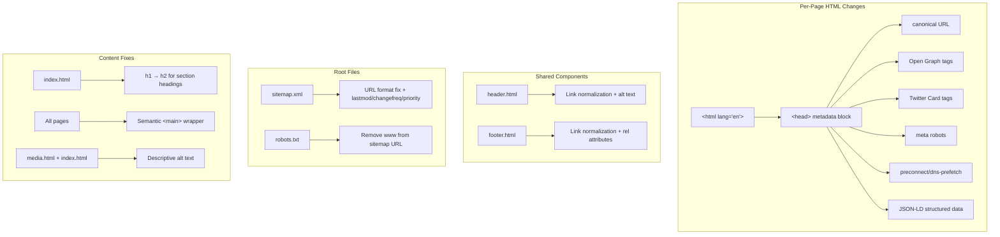

# Design Document: SEO Improvement

## Overview

This design addresses 16 SEO requirements for the GAMEC static website (https://igamec.org). The site consists of 16 HTML pages plus shared `header.html` and `footer.html` components loaded dynamically via `includes.js`. The current SEO baseline includes basic `<title>`, `<meta description>`, charset, viewport, favicons, a `sitemap.xml`, and `robots.txt`. This design covers adding HTML lang attributes, canonical URLs, Open Graph and Twitter Card meta tags, JSON-LD structured data, heading hierarchy fixes, image alt text optimization, sitemap corrections, robots.txt fix, semantic HTML enhancements, meta robots tags, internal link normalization, external link security, and performance meta tags.

All changes are static HTML edits — no build tools, server-side rendering, or JavaScript frameworks are involved. The existing `includes.js` dynamic loading of header/footer is preserved as-is.

## Architecture

The SEO improvements are purely additive HTML/metadata changes applied directly to the existing static file structure. No new architectural components are introduced.



### Change Categories

1. **Head metadata** (all 16 pages): lang attribute, canonical, OG tags, Twitter tags, meta robots, preconnect hints
2. **JSON-LD structured data**: Organization + WebSite on homepage; BreadcrumbList on 15 inner pages
3. **Content structure**: heading hierarchy fix on index.html, `<main>` wrapper on all pages
4. **Image optimization**: descriptive alt text across all pages, header.html logo alt
5. **Root files**: sitemap.xml URL format + metadata, robots.txt domain fix
6. **Link hygiene**: internal link format normalization, external link `rel` attributes

## Components and Interfaces

Since this is a static HTML site with no application code, "components" here refers to the distinct categories of SEO markup being added or modified.

### 1. Page Head Metadata Block

Each of the 16 pages gets a standardized metadata block inserted into `<head>`:

```html
<!-- Canonical -->
<link rel="canonical" href="https://igamec.org/{page}.html" />

<!-- Open Graph -->
<meta property="og:title" content="{page title}" />
<meta property="og:description" content="{page meta description}" />
<meta property="og:url" content="https://igamec.org/{page}.html" />
<meta property="og:type" content="website" />
<meta property="og:image" content="https://igamec.org/images/logo-bg.png" />
<meta property="og:site_name" content="GAMEC" />
<meta property="og:locale" content="en_US" />

<!-- Twitter Card -->
<meta name="twitter:card" content="summary" />
<meta name="twitter:title" content="{page title}" />
<meta name="twitter:description" content="{page meta description}" />
<meta name="twitter:image" content="https://igamec.org/images/logo-bg.png" />

<!-- Robots -->
<meta name="robots" content="index, follow" />

<!-- Performance -->
<link rel="dns-prefetch" href="https://fonts.googleapis.com" />
```

### 2. JSON-LD Structured Data

**Homepage (index.html)** gets two JSON-LD blocks:

- `Organization` (with `NonprofitOrganization` subtype) containing name, URL, logo, description, contact info, and sameAs
- `WebSite` containing site name, URL, and description

**Inner pages (15 pages)** each get one JSON-LD block:

- `BreadcrumbList` with Home → [optional parent section] → Current Page

Breadcrumb parent mapping:
| Page | Parent | 
|------|--------|
| vision.html | About Us |
| history.html | About Us |
| leadership.html | About Us |
| contact.html | About Us |
| programs.html | (none — top-level) |
| relief.html | Programs |
| sisters.html | Programs |
| youth.html | Programs |
| seniors.html | Programs |
| professionals.html | Programs |
| health.html | Programs |
| matrimonial.html | Programs |
| membership.html | (none — top-level) |
| media.html | (none — top-level) |
| resources.html | (none — top-level) |
| donate.html | (none — top-level) |

### 3. Sitemap Updates

The `sitemap.xml` needs:
- All URLs converted to `.html` extension format (e.g., `https://igamec.org/vision.html` instead of `https://igamec.org/vision/`)
- Homepage URL: `https://igamec.org/`
- `<lastmod>`, `<changefreq>`, and `<priority>` added to every entry

### 4. Shared Component Updates

**header.html:**
- Logo `alt` attribute updated to include organization name
- `index.html` link normalized to `./index.html` for consistency

**footer.html:**
- External links verified for `rel="noopener noreferrer"` and `target="_blank"`

## Data Models

No database or application data models are involved. The "data" here is the structured metadata embedded in HTML.

### JSON-LD Organization Schema (homepage)

```json
{
  "@context": "https://schema.org",
  "@type": ["NonprofitOrganization", "Organization"],
  "name": "GAMEC - Global Association of Muslim Eritrean Communities",
  "url": "https://igamec.org",
  "logo": "https://igamec.org/images/logo-bg.png",
  "description": "Welcome to the Global Association of Muslim Eritrean Communities (GAMEC). Join us in fostering unity, culture, and understanding within the Muslim Eritrean community.",
  "telephone": "+1-202-440-9089",
  "email": "contact@igamec.org",
  "address": {
    "@type": "PostalAddress",
    "streetAddress": "3420 13th St SE",
    "addressLocality": "Washington",
    "addressRegion": "DC",
    "postalCode": "20032",
    "addressCountry": "US"
  },
  "sameAs": ["https://www.facebook.com/TheOfficialGAMEC/"]
}
```

### JSON-LD WebSite Schema (homepage)

```json
{
  "@context": "https://schema.org",
  "@type": "WebSite",
  "name": "GAMEC",
  "url": "https://igamec.org",
  "description": "Global Association of Muslim Eritrean Communities — fostering unity, culture, and understanding."
}
```

### JSON-LD BreadcrumbList Schema (inner pages, example for relief.html)

```json
{
  "@context": "https://schema.org",
  "@type": "BreadcrumbList",
  "itemListElement": [
    {
      "@type": "ListItem",
      "position": 1,
      "name": "Home",
      "item": "https://igamec.org/"
    },
    {
      "@type": "ListItem",
      "position": 2,
      "name": "Programs",
      "item": "https://igamec.org/programs.html"
    },
    {
      "@type": "ListItem",
      "position": 3,
      "name": "GAMEC Charity",
      "item": "https://igamec.org/relief.html"
    }
  ]
}
```

### Sitemap Entry Schema

```xml
<url>
  <loc>https://igamec.org/vision.html</loc>
  <lastmod>2025-01-01</lastmod>
  <changefreq>monthly</changefreq>
  <priority>0.8</priority>
</url>
```

### Page Metadata Reference Table

| Page | Title | Canonical URL | Has lang? | Has h1 issue? |
|------|-------|--------------|-----------|---------------|
| index.html | Global Association of Muslim Eritrean Communities \| GAMEC | https://igamec.org/ | ❌ | ✅ Multiple h1s |
| vision.html | Mission & Vision \| GAMEC | https://igamec.org/vision.html | ✅ | ❌ |
| history.html | History \| GAMEC | https://igamec.org/history.html | ❌ | ❌ |
| leadership.html | Leadership Team \| GAMEC | https://igamec.org/leadership.html | ❌ | ❌ |
| contact.html | Contact Us \| GAMEC | https://igamec.org/contact.html | ✅ | ❌ |
| programs.html | Programs \| GAMEC | https://igamec.org/programs.html | ❌ | ❌ |
| membership.html | Membership \| GAMEC | https://igamec.org/membership.html | ✅ | ❌ |
| donate.html | Donate \| GAMEC | https://igamec.org/donate.html | ❌ | ❌ |
| resources.html | Resources \| GAMEC | https://igamec.org/resources.html | ❌ | ❌ |
| media.html | Media \| GAMEC | https://igamec.org/media.html | ✅ | ❌ |
| relief.html | Charity \| GAMEC | https://igamec.org/relief.html | ❌ | ❌ |
| sisters.html | Sisters \| GAMEC | https://igamec.org/sisters.html | ❌ | ❌ |
| youth.html | Youth \| GAMEC | https://igamec.org/youth.html | ❌ | ❌ |
| seniors.html | Seniors \| GAMEC | https://igamec.org/seniors.html | ❌ | ❌ |
| professionals.html | Professionals \| GAMEC | https://igamec.org/professionals.html | ❌ | ❌ |
| health.html | Health Services \| GAMEC | https://igamec.org/health.html | ✅ | ❌ |
| matrimonial.html | Matrimonial \| GAMEC | https://igamec.org/matrimonial.html | ❌ | ❌ |


## Correctness Properties

*A property is a characteristic or behavior that should hold true across all valid executions of a system — essentially, a formal statement about what the system should do. Properties serve as the bridge between human-readable specifications and machine-verifiable correctness guarantees.*

### Property 1: Every page declares English language

*For any* HTML page in the site, the `<html>` element must have a `lang="en"` attribute.

**Validates: Requirements 1.1**

### Property 2: Every page has a correctly formatted canonical URL

*For any* HTML page in the site, the `<head>` must contain a `<link rel="canonical">` element whose `href` is the full absolute URL `https://igamec.org/{filename}` (or `https://igamec.org/` for the homepage).

**Validates: Requirements 2.1, 2.2, 2.3**

### Property 3: Social meta title tags match the page title

*For any* HTML page in the site, both `og:title` and `twitter:title` meta tags must exist and their `content` must match the page's `<title>` element text.

**Validates: Requirements 3.1, 4.2**

### Property 4: Social meta description tags match the page meta description

*For any* HTML page in the site, both `og:description` and `twitter:description` meta tags must exist and their `content` must match the page's `<meta name="description">` content.

**Validates: Requirements 3.2, 4.3**

### Property 5: Social meta image tags reference the GAMEC logo

*For any* HTML page in the site, both `og:image` and `twitter:image` meta tags must exist and their `content` must be `https://igamec.org/images/logo-bg.png`.

**Validates: Requirements 3.5, 4.4**

### Property 6: Every page has all required static Open Graph and Twitter Card tags

*For any* HTML page in the site, the following meta tags must exist with the specified values: `og:url` matching the canonical URL, `og:type` = `website`, `og:site_name` = `GAMEC`, `og:locale` = `en_US`, `twitter:card` = `summary`.

**Validates: Requirements 3.3, 3.4, 3.6, 3.7, 4.1**

### Property 7: Every inner page has a valid BreadcrumbList with correct structure

*For any* HTML page other than the homepage, a JSON-LD `BreadcrumbList` must exist where position 1 is "Home" pointing to `https://igamec.org/`, the final position item matches the current page's name and URL, and pages belonging to a sub-section include the parent section as an intermediate breadcrumb.

**Validates: Requirements 6.1, 6.2, 6.3, 6.4**

### Property 8: Every page has exactly one h1 and no skipped heading levels

*For any* HTML page in the site, there must be exactly one `<h1>` element, and heading levels must not skip (e.g., no `<h3>` without a preceding `<h2>` in the same content flow).

**Validates: Requirements 8.1, 8.2, 8.3**

### Property 9: Every image has a non-empty alt attribute

*For any* `` element across all HTML pages and shared components, the `alt` attribute must exist and be non-empty (unless the image is explicitly decorative with `role="presentation"`).

**Validates: Requirements 9.1**

### Property 10: Sitemap entries use consistent .html URL format and include required metadata

*For any* URL entry in `sitemap.xml`, the `<loc>` must use `.html` extension format (except the homepage which uses `/`), and each entry must include `<lastmod>`, `<changefreq>`, and `<priority>` child elements.

**Validates: Requirements 10.1, 10.2, 10.3, 10.4**

### Property 11: Every page wraps content in a semantic main element

*For any* HTML page in the site, the primary content area must be wrapped in a `<main>` element.

**Validates: Requirements 12.1**

### Property 12: Every page includes a meta robots tag

*For any* HTML page in the site, the `<head>` must contain `<meta name="robots" content="index, follow">`.

**Validates: Requirements 13.1**

### Property 13: All internal links use consistent relative path format

*For any* internal link across all HTML pages and shared components, the `href` must use the `./page.html` relative path format consistently.

**Validates: Requirements 14.1**

### Property 14: All external links have security attributes

*For any* external link (pointing to a domain other than igamec.org) across all HTML pages and shared components, the element must include `target="_blank"` and `rel` containing both `noopener` and `noreferrer`.

**Validates: Requirements 15.1, 15.2**

### Property 15: Every page includes performance hint meta tags

*For any* HTML page in the site, the `<head>` must include `<link rel="dns-prefetch" href="https://fonts.googleapis.com">`. Pages that load Google Fonts must also include the corresponding `preconnect` hints.

**Validates: Requirements 16.1, 16.2, 16.3**

## Error Handling

Since this feature involves static HTML metadata changes with no runtime logic, error handling is minimal:

- **Missing meta tags**: If a page is missing a required meta tag, the property tests will catch it. The fix is to add the tag.
- **Malformed JSON-LD**: If structured data JSON is malformed, browsers will silently ignore it but Google Search Console will report errors. Validate JSON-LD syntax by ensuring valid JSON in script blocks.
- **Sitemap URL mismatches**: If sitemap URLs don't match actual file paths, search engines will get 404s. The sitemap must be validated against the actual file list.
- **Broken canonical URLs**: If canonical URLs point to non-existent pages, search engines may de-index content. Canonical URLs must match the known page list.

No application-level error handling code is needed — all validation is done through testing.

## Testing Strategy

### Property-Based Testing

The project already uses **vitest** with **fast-check** for property-based testing (see existing tests in `tests/`). All correctness properties will be implemented as property-based tests using this stack.

Each property test will:
- Read the HTML files from disk using `fs.readFileSync`
- Parse HTML content to extract relevant elements (using regex or simple string matching for static HTML)
- Use `fc.constantFrom(...)` to generate random page selections from the known page list
- Run a minimum of 100 iterations per property
- Be tagged with a comment referencing the design property

**Test file**: `tests/seo-meta.property.test.mjs`

Tag format: `Feature: seo-improvement, Property {N}: {title}`

### Unit Tests

Unit tests will cover specific examples and edge cases:
- Homepage canonical URL is exactly `https://igamec.org/`
- Homepage has Organization and WebSite JSON-LD blocks with correct field values (Req 5.1-5.4, 7.1-7.2)
- Header logo alt text includes "GAMEC" (Req 9.3)
- robots.txt contains `https://igamec.org/sitemap.xml` without `www` (Req 11.1)
- header.html uses `<header>` element, footer.html uses `<footer>` element, header.html has `<nav>` (Req 12.2-12.4)
- Pages with articles use `<article>` elements (Req 12.5)

**Test file**: `tests/seo-meta.unit.test.mjs`

### Validation Approach

Since all changes are static HTML, tests read files directly from disk — no server or browser needed. This keeps tests fast and deterministic.
