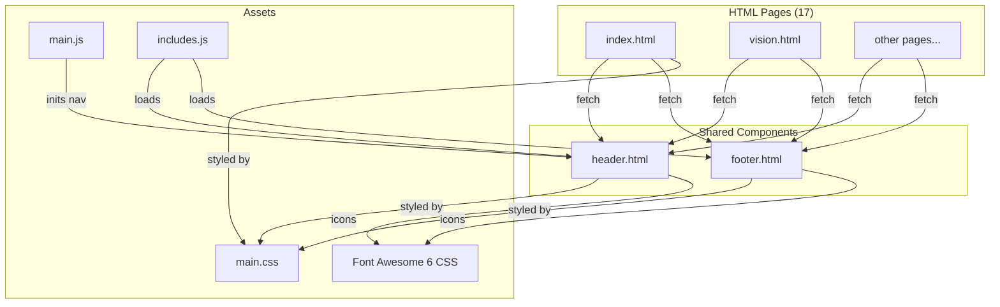

# Design Document: Site Quality Improvements

## Overview

This design covers a cohesive quality improvement pass across the GAMEC website (igamec.org), addressing 17 requirements spanning accessibility (WCAG 2.1 AA), visual design, layout optimization, and cross-browser/maintainability concerns. The site is a static HTML site with 17 pages, shared `header.html` and `footer.html` loaded dynamically via JS, jQuery-based navigation with the Dropotron plugin, and a single `main.css` stylesheet.

The changes are organized into four coordinated layers that build on each other:

1. **Foundation layer** — CSS fixes and utilities that all other changes depend on (gradient syntax, focus indicators, visually-hidden class, grid DRY-up, 980px transition zone)
2. **Accessibility layer** — HTML and JS changes for WCAG compliance (viewport meta, skip link, ARIA landmarks, keyboard nav, mobile toggle, screen reader labels, empty anchors, noscript fallback)
3. **Content & visual layer** — Placeholder replacement, banner visual impact, social icon touch targets
4. **Dependency modernization layer** — Replace Dropotron with custom WAI-ARIA disclosure nav, upgrade Font Awesome 5 → 6

This ordering ensures that foundational CSS utilities (e.g., `.visually-hidden`, focus indicator styles) exist before the accessibility HTML changes reference them, and that the Dropotron replacement (Req 16) is coordinated with the keyboard nav work (Req 4) and mobile toggle work (Req 5) since they all touch the same navigation system.

## Architecture

The site architecture remains a static HTML site with no build step. All changes are made directly to HTML files, `main.css`, `main.js`, and `includes.js`.



### Key Architectural Decisions

1. **No build tooling** — All changes are hand-edited in source files. The site has no bundler, preprocessor pipeline, or CI. The Sass source files exist but the compiled `main.css` is what's deployed, so all CSS changes target `main.css` directly.

2. **Navigation rewrite is self-contained in `main.js`** — The Dropotron replacement (Req 16) and keyboard nav (Req 4) and mobile toggle (Req 5) are all implemented together in `main.js` via a new `initNavigation()` function that replaces the current one. This avoids split logic across files.

3. **Font Awesome upgrade is a drop-in replacement** — FA6 Free is backward-compatible with FA5 class names via a compatibility layer. The upgrade swaps the CSS file and updates any deprecated class names.

4. **All 17 pages share the same viewport fix and noscript block** — These are applied uniformly via a find-and-replace pass across all HTML files.

## Components and Interfaces

### 1. CSS Utilities & Foundation (main.css)

These new/modified CSS rules form the foundation for all other changes.

| Component | Purpose | Location |
|---|---|---|
| `.visually-hidden` class | Hide content visually while keeping it in the accessibility tree. Used by skip link (Req 2), social icon labels (Req 6). | `main.css` — new utility class |
| Focus indicator styles | Replace all bare `outline: 0` with a consistent `:focus-visible` style. 2px solid outline with offset, 3:1+ contrast against backgrounds. | `main.css` — modify existing `outline: 0` declarations |
| Gradient syntax fix | Change `linear-gradient(top, ...)` → `linear-gradient(to bottom, ...)` in the body background. Keep vendor prefixes. | `main.css` line ~240-252 |
| Grid DRY-up | Extract shared `.row` flex/alignment rules out of media query blocks so they're defined once. Media queries only override column widths and gutters. | `main.css` grid section |
| 980px transition zone | Change medium breakpoint container from `90%` to `95%` width, adjust padding. | `main.css` medium breakpoint |

#### `.visually-hidden` CSS pattern

```css
.visually-hidden {
  position: absolute;
  width: 1px;
  height: 1px;
  padding: 0;
  margin: -1px;
  overflow: hidden;
  clip: rect(0, 0, 0, 0);
  clip-path: inset(50%);
  white-space: nowrap;
  border: 0;
}
```

#### Focus indicator approach

The existing CSS has `outline: 0` in four places (links, buttons, `.image`, widget contact links). The design:
- Remove bare `outline: 0` from all four locations
- Add a single `:focus-visible` rule block for `a`, `button`, `.button`, `input`, `select`, `textarea`, `.image` that applies `outline: 2px solid var(--color-accent); outline-offset: 2px;`
- The existing `:focus-visible` block at line ~4610 already does this — verify it covers all four locations and that the bare `outline: 0` declarations are removed

### 2. Skip Navigation Link (header.html + main.css)

Add a skip link as the first element inside `header.html`, before the logo:

```html
<a href="#main-wrapper" class="skip-link visually-hidden">Skip to main content</a>
```

CSS for the skip link when focused:

```css
.skip-link:focus {
  position: fixed;
  top: 10px;
  left: 10px;
  z-index: 100000;
  padding: 0.8em 1.5em;
  background: var(--color-primary);
  color: var(--color-white);
  font-weight: 700;
  border-radius: 4px;
  text-decoration: none;
  /* Override visually-hidden properties */
  width: auto;
  height: auto;
  clip: auto;
  clip-path: none;
  margin: 0;
  overflow: visible;
  white-space: normal;
}
```

The `#main-wrapper` target already exists on every page as the `<main>` element. Add `tabindex="-1"` to `#main-wrapper` in each page so focus can be programmatically moved there.

### 3. ARIA Landmarks (header.html + footer.html)

**header.html changes:**
- Add `role="banner"` to the `<header>` element
- Add `role="navigation"` and `aria-label="Main navigation"` to the `<nav id="nav">` element

**footer.html changes:**
- Add `role="contentinfo"` to the `<footer id="footer">` element

These attributes are set in the static HTML partials, so they survive the dynamic injection via `includes.js` without any JS changes.

### 4. Keyboard-Accessible Dropdown Navigation (main.js + header.html)

This is the most complex component. It replaces the jQuery Dropotron plugin with a custom WAI-ARIA disclosure navigation pattern.

#### header.html changes

Add ARIA attributes to parent links that have dropdown menus:

```html
<li>
  <a href="./vision.html" aria-haspopup="true" aria-expanded="false">
    About Us <span class="hide-arrow">⏷</span>
  </a>
  <ul>...</ul>
</li>
```

#### main.js — new `initNavigation()` implementation

Replace the current `initNavigation()` function. The new version:

1. **Desktop dropdowns** — No Dropotron. Instead:
   - On `mouseenter` of a parent `<li>`, show its `<ul>` child and set `aria-expanded="true"`
   - On `mouseleave`, hide and set `aria-expanded="false"`
   - On `Enter`/`Space`/`ArrowDown` on a parent link, open the dropdown and focus the first item
   - `ArrowUp`/`ArrowDown` navigate within the open dropdown
   - `Escape` closes the dropdown and returns focus to the parent link
   - `Tab` closes the dropdown and moves focus to the next top-level item

2. **Dropdown positioning & animation** — CSS handles positioning (absolute, below parent) and fade animation via `opacity` transition, matching the current Dropotron visual behavior.

3. **Mobile panel** — Keep the existing slide-in panel approach but use a `<button>` element for the toggle (Req 5).

#### CSS for dropdown (replaces Dropotron-injected styles)

```css
/* Desktop dropdown menu */
#nav > ul > li {
  position: relative;
}

#nav > ul > li > ul {
  display: none;
  position: absolute;
  top: 100%;
  left: 0;
  min-width: 15em;
  background: var(--color-white);
  border: 1px solid var(--color-border-light);
  box-shadow: 0 8px 16px var(--color-shadow-medium);
  border-radius: 6px;
  z-index: 1000;
  opacity: 0;
  transition: opacity 0.3s ease;
}

#nav > ul > li > ul.is-open {
  display: block;
  opacity: 1;
}
```

### 5. Accessible Mobile Nav Toggle (main.js)

Replace the current `<div id="navToggle"><a>` with a proper `<button>`:

```html
<button id="navToggle" type="button" aria-label="Open menu" aria-expanded="false">
  <span class="toggle-icon"></span>
</button>
```

In `main.js`, when the panel opens:
- Set `aria-expanded="true"` and `aria-label="Close menu"`

When the panel closes:
- Set `aria-expanded="false"` and `aria-label="Open menu"`

The toggle icon uses the same Font Awesome hamburger icon (`\f0c9`) via CSS `::before` pseudo-element, matching the current visual.

### 6. Social Media Icon Labels (footer.html + main.css)

Current footer social links use `<span class="label">Twitter</span>` with `.label { display: none }`. This hides the text from screen readers.

**Fix:** Replace `class="label"` with `class="visually-hidden"` on all social icon label spans in `footer.html`:

```html
<a href="#" class="icon brands fa-twitter">
  <span class="visually-hidden">Twitter</span>
</a>
```

The `.visually-hidden` class (defined in the foundation layer) keeps the text in the accessibility tree while hiding it visually.

### 7. Viewport Meta Tag Fix (all 17 HTML pages)

Current: `content="width=device-width, initial-scale=1, user-scalable=no"`

Change to: `content="width=device-width, initial-scale=1"`

This is a simple find-and-replace across all 17 HTML files. Remove both `user-scalable=no` and any `maximum-scale=1` if present.

### 8. Empty Anchor Tags on Feature Images (index.html)

The homepage features section has three `<a class="image featured">` elements wrapping images, but none have `href` attributes:

```html
<a class="image featured"></a>
```

**Fix:** Each feature box already has a "Learn More" link below. Either:
- **Option A:** Add the corresponding `href` to each `<a>` tag (e.g., `href="./vision.html"`)
- **Option B:** Replace the `<a>` with a `<div>`

**Decision:** Option A — add `href` values pointing to the same destination as the "Learn More" link in each feature box. This makes the images clickable, which is a better UX pattern for card-style layouts.

### 9. Banner Visual Impact (index.html + main.css)

Add a background image to the banner section. The site already has `images/city.jpg` and `images/asmara-mosque.jpg` available.

**Approach:**
- Add a CSS background image to `#banner-wrapper` using an existing image (e.g., `city.jpg`)
- Apply a dark overlay using a `linear-gradient` over the image for text contrast
- Adjust text color to white/light for readability over the dark overlay
- Ensure the banner remains readable at all breakpoints

```css
#banner-wrapper {
  background: linear-gradient(to bottom, rgba(0, 31, 63, 0.82), rgba(0, 31, 63, 0.9)),
              url('../images/city.jpg') center/cover no-repeat;
  color: var(--color-white);
}
```

Adjust banner text colors, button styles, and the gold underline to work against the dark background.

### 10. Placeholder Content Replacement

Pages with placeholder content to address:

| Page | Current placeholder | Replacement approach |
|---|---|---|
| `history.html` | `<h2>More coming soon</h2>` | Remove the heading. The existing paragraph is sufficient as a brief history. |
| `sisters.html` | `<h2>More coming sooon</h2>` | Remove the heading. Add a brief "Get Involved" call-to-action section with a contact link. |
| `health.html` | `<h2>More coming soon</h2>` | Remove the heading. Add a "Get Involved" CTA linking to the contact page. |
| `programs.html` | No direct placeholder, but sidebar has "planned" language | No change needed — the sidebar content is substantive. |
| `youth.html` | `<h3>Youth Sports are coming soon</h3>` | Replace with a brief description of the planned sports program and a "Stay tuned" message with a contact/signup link. |
| `professionals.html` | `WhatsApp Group — Coming Soon.` | Rephrase to "WhatsApp Group — launching soon. Contact us to express interest." |
| `media.html` | `Coming soon:` and `Audio collection coming soon.` | Rephrase to describe what's planned without using "coming soon" phrasing. E.g., "GAMEC is producing original content and interviews" and "Audio collection is in development." |

### 11. Footer Social Icon Touch Targets (main.css)

Current social icon links are `2.5em × 2.5em` (≈40px at base font size). WCAG 2.5.5 requires 44×44px minimum.

**Fix in `main.css`:**

```css
#footer .widget.contact ul li a {
  width: 44px;
  height: 44px;
  line-height: 44px;
  min-width: 44px;
  min-height: 44px;
}

#footer .widget.contact ul li {
  margin-right: 8px; /* minimum 8px spacing between icons */
}
```

Use fixed `px` values instead of `em` to guarantee the 44px minimum regardless of font-size scaling at different breakpoints.

### 12. CSS Grid DRY-Up (main.css)

The current CSS repeats the full `.row` flexbox setup (display, flex-wrap, alignment utilities) inside each media query block (default, xlarge, large, medium, small). Only column widths and gutter sizes actually change per breakpoint.

**Approach:**
- Keep the base `.row` rules (flex, wrap, alignment) defined once at the top level (already done at line ~635)
- In each media query, remove the duplicated `.row` display/flex/alignment rules
- Keep only the breakpoint-specific column width overrides (`.col-X-medium`, `.col-X-small`, etc.) and gutter overrides in the media queries
- Verify visual output is identical after refactoring

The medium breakpoint block (line ~1380) currently re-declares `.row { display: flex; flex-wrap: wrap; ... }` and all alignment classes. These can be removed since the base rules already apply.

### 13. 980px Transition Zone Fix (main.css)

At the medium breakpoint (737–980px), the container uses `width: 90%`. This feels cramped when the nav switches to the mobile panel.

**Fix:**
- Change the medium breakpoint container width to `95%`
- Ensure padding on `#main-wrapper` and `#banner` is comfortable (at least 1.5em horizontal)
- Smooth the transition between large (960px fixed) and medium (95% fluid) by ensuring no abrupt jumps in content width

### 14. Gradient Syntax Fix (main.css)

Lines 241–252 use legacy `linear-gradient(top, ...)` syntax. Fix:

```css
background-image:
  -moz-linear-gradient(top, var(--color-overlay-dark), rgba(0, 0, 0, 0)),
  url("images/bg01.png");
background-image:
  -webkit-linear-gradient(top, var(--color-overlay-dark), rgba(0, 0, 0, 0)),
  url("images/bg01.png");
background-image:
  linear-gradient(to bottom, var(--color-overlay-dark), rgba(0, 0, 0, 0)),
  url("images/bg01.png");
```

Keep the `-moz-` and `-webkit-` prefixed versions with the legacy `top` keyword (that's the correct syntax for those prefixes). Only the unprefixed `linear-gradient()` uses the standard `to bottom` syntax. Remove the `-ms-` prefixed version as it's unnecessary for modern Edge.

### 15. Noscript Fallback (all 17 HTML pages)

Add a `<noscript>` block to every page, placed right after the opening `<body>` tag (inside `#page-wrapper` or just before it):

```html
<noscript>
  <div style="padding: 2em; text-align: center; background: #faf8f5; border-bottom: 2px solid #d4af37; font-family: Roboto, sans-serif;">
    <p style="margin: 0 0 1em; font-size: 1.1em; color: #001f3f;">
      <strong>JavaScript is required for full site functionality.</strong>
    </p>
    <nav style="font-size: 1em;">
      <a href="./index.html" style="margin: 0 0.5em; color: #006994;">Home</a> |
      <a href="./vision.html" style="margin: 0 0.5em; color: #006994;">About</a> |
      <a href="./programs.html" style="margin: 0 0.5em; color: #006994;">Programs</a> |
      <a href="./contact.html" style="margin: 0 0.5em; color: #006994;">Contact</a> |
      <a href="./donate.html" style="margin: 0 0.5em; color: #006994;">Donate</a>
    </nav>
  </div>
</noscript>
```

Inline styles are used intentionally because the noscript fallback must be readable even if CSS loading depends on JS (it doesn't in this case, but inline styles are the safest pattern for noscript blocks).

### 16. Dropotron Replacement (main.js + HTML pages)

**Remove:**
- The `<script src="assets/js/jquery.dropotron.min.js"></script>` tag from all 17 HTML pages
- The `$nav.find("ul").dropotron(...)` call from `main.js`

**Replace with:** The custom dropdown logic described in Component 4 above. The new `initNavigation()` function handles both desktop dropdowns and mobile panel creation without Dropotron.

**Visual parity:** The new CSS dropdown uses the same fade animation (opacity transition, 300ms), same positioning (absolute, below parent), same min-width (15em), and same box-shadow as the Dropotron-generated dropdowns.

### 17. Font Awesome 6 Upgrade

**Steps:**
1. Replace `assets/css/fontawesome-all.min.css` with the Font Awesome 6 Free `all.min.css`
2. Replace the webfont files in `assets/webfonts/` with FA6 versions
3. Update any deprecated class names. Key changes from FA5 → FA6:
   - `fab` → `fa-brands` (backward-compatible alias exists)
   - `fas` → `fa-solid` (backward-compatible alias exists)
   - `far` → `fa-regular` (backward-compatible alias exists)
   - Check for any icons removed or renamed in FA6
4. Update the CSS `font-family` reference in `#navToggle .toggle:before` from `"Font Awesome 5 Free"` to `"Font Awesome 6 Free"` (or use the FA6 class-based approach)

FA6 Free includes a compatibility shim for FA5 class names, so most existing `fas`, `fab`, `far` classes will continue to work. A manual audit of all icon references across HTML files is needed to catch any edge cases.

## Data Models

No data model changes. The site is static HTML with no database or API. All content is stored directly in HTML files.

## Error Handling

| Scenario | Handling |
|---|---|
| Header/footer fetch fails | Existing `includes.js` error handling logs to console. The new `<noscript>` fallback provides basic navigation when JS is disabled entirely. |
| Dropdown keyboard navigation on elements without submenus | The keyboard handler checks for the presence of a child `<ul>` before attempting to open a dropdown. No-op on items without submenus. |
| Font Awesome 6 icon not found | FA6 shows a blank square for missing icons. The audit step catches renamed/removed icons before deployment. |
| Skip link target missing | The `#main-wrapper` element exists on every page. If somehow missing, the browser scrolls to top (graceful degradation). |
| Browser doesn't support `:focus-visible` | Falls back to no custom focus indicator, but the browser's default focus ring still appears since we're removing `outline: 0`. Older browsers that don't support `:focus-visible` will show the default outline on all focus (not just keyboard), which is acceptable. |

## Testing Strategy

Per the user's instructions, no automated tests or property-based tests are included in this design. Validation will be done through manual testing:

- **Accessibility audit:** Use browser DevTools accessibility inspector and a screen reader (VoiceOver/NVDA) to verify ARIA landmarks, skip link, keyboard navigation, and focus indicators
- **Visual regression:** Compare screenshots before/after at each breakpoint (1680px, 1280px, 980px, 736px) to verify layout parity
- **Cross-browser check:** Test in Chrome, Firefox, Safari, and Edge to verify gradient rendering and FA6 icons
- **Keyboard walkthrough:** Tab through every page to verify focus indicators, dropdown keyboard support, and skip link functionality
- **Mobile testing:** Test on iOS Safari and Android Chrome for pinch-to-zoom, touch targets, and mobile nav toggle
